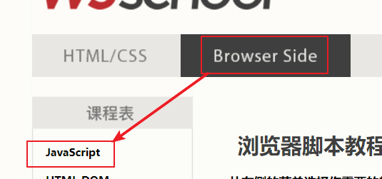
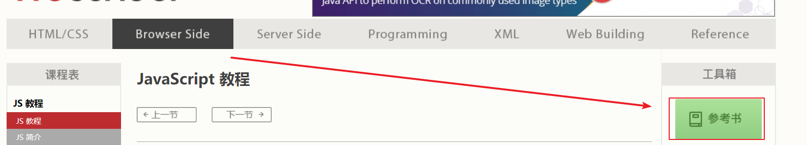
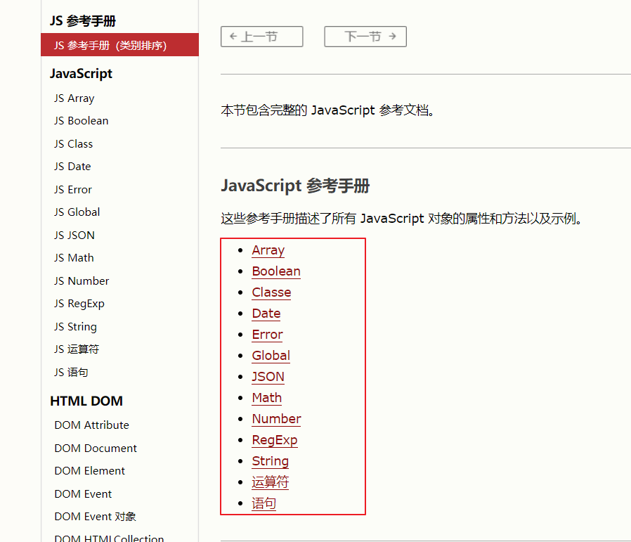
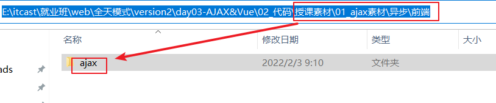
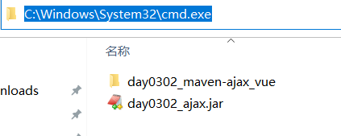
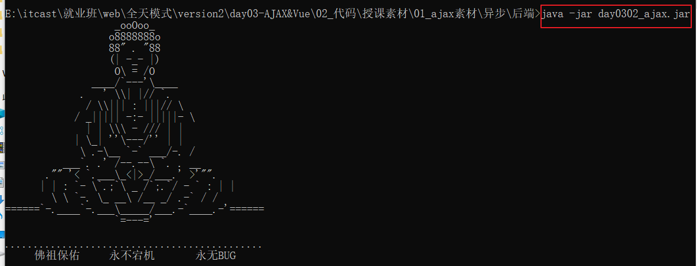
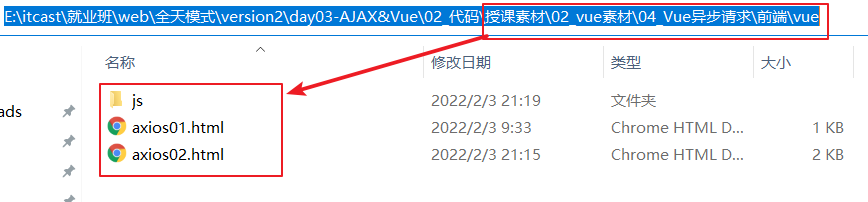
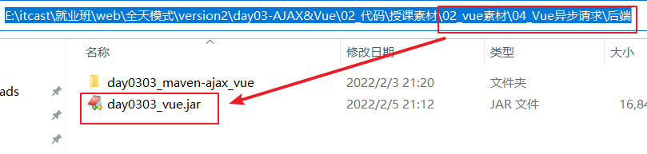
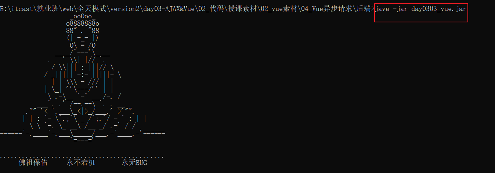

# 随堂笔记

# 1.API查阅

【1】

【2】

【3】

# 2.es新语法(基础)

## 1.变量定义

~~~html
<!-- 文档类型声明标签，告知浏览器这个页面采取html版本来显示页面 -->
<!DOCTYPE html>
<!-- 告诉浏览器这是一个英文网站，本页面采取英文显示，单也可以书写中文 -->
<html lang="en">

<head>
    <!-- 必须书写，告知浏览器以UTF-8编码表编解码中文，如果不书写就会乱码 -->
    <meta charset="UTF-8">
    <meta http-equiv="X-UA-Compatible" content="IE=edge">
    <meta name="viewport" content="width=device-width, initial-scale=1.0">
    <!-- 标题标签 -->
    <title>Title</title>
</head>
<body>

</body>

</html>
~~~

## 2.定义常量

~~~html
<!-- 文档类型声明标签，告知浏览器这个页面采取html版本来显示页面 -->
<!DOCTYPE html>
<!-- 告诉浏览器这是一个英文网站，本页面采取英文显示，单也可以书写中文 -->
<html lang="en">

<head>
    <!-- 必须书写，告知浏览器以UTF-8编码表编解码中文，如果不书写就会乱码 -->
    <meta charset="UTF-8">
    <meta http-equiv="X-UA-Compatible" content="IE=edge">
    <meta name="viewport" content="width=device-width, initial-scale=1.0">
    <!-- 标题标签 -->
    <title>Title</title>
</head>
<body>

</body>

</html>
~~~

## 3.模板字符串：方便字符串的拼接

~~~html
<!-- 文档类型声明标签，告知浏览器这个页面采取html版本来显示页面 -->
<!DOCTYPE html>
<!-- 告诉浏览器这是一个英文网站，本页面采取英文显示，单也可以书写中文 -->
<html lang="en">

<head>
    <!-- 必须书写，告知浏览器以UTF-8编码表编解码中文，如果不书写就会乱码 -->
    <meta charset="UTF-8">
    <meta http-equiv="X-UA-Compatible" content="IE=edge">
    <meta name="viewport" content="width=device-width, initial-scale=1.0">
    <!-- 标题标签 -->
    <title>Title</title>
</head>
<body>

</body>

</html>
~~~

## 4.函数参数默认值(了解)

在js中如果定义的函数有参数，调用的时候可以不传递实参，那么形参变量名就是undefined类型，为了解决这个问题，es6后引入函数参数默认值。如果调用函数的时候不传递实参，那么使用默认值。如果传递实参那么使用实参。

~~~html
<!-- 文档类型声明标签，告知浏览器这个页面采取html版本来显示页面 -->
<!DOCTYPE html>
<!-- 告诉浏览器这是一个英文网站，本页面采取英文显示，单也可以书写中文 -->
<html lang="en">

<head>
    <!-- 必须书写，告知浏览器以UTF-8编码表编解码中文，如果不书写就会乱码 -->
    <meta charset="UTF-8">
    <meta http-equiv="X-UA-Compatible" content="IE=edge">
    <meta name="viewport" content="width=device-width, initial-scale=1.0">
    <!-- 标题标签 -->
    <title>Title</title>
</head>
<body>

</body>

</html>
~~~

## 5.箭头函数(很重要)

~~~html
<!-- 文档类型声明标签，告知浏览器这个页面采取html版本来显示页面 -->
<!DOCTYPE html>
<!-- 告诉浏览器这是一个英文网站，本页面采取英文显示，单也可以书写中文 -->
<html lang="en">

<head>
    <!-- 必须书写，告知浏览器以UTF-8编码表编解码中文，如果不书写就会乱码 -->
    <meta charset="UTF-8">
    <meta http-equiv="X-UA-Compatible" content="IE=edge">
    <meta name="viewport" content="width=device-width, initial-scale=1.0">
    <!-- 标题标签 -->
    <title>Title</title>
</head>
<body>

</body>

</html>
~~~

# 3.今日目标和应用

~~~markdown
1.使用ajax完成和后台服务器数据交互
2.json:能够在使用ajax传输数据的时候，书写json数据
3.vue:简化原生js的操作
~~~

# 4.ajax介绍(理解)

1.可以完成前端和后台服务器的数据交互

2.好处：

> 1)网页局部更新
>
> 2）异步请求

# 5.ajax的异步操作axios(掌握)

## 1.axios入门案例

【1】导入前端素材到vscode中

【2】启动后端项目(先不用管，只需要如何启动即可)

在后端项目位置输入cmd,打开dos窗口

**java -jar jar包的名**

【3】书写前端代码(重点)

get请求

~~~html
<!DOCTYPE html>
<html lang="en">
<head>
    <meta charset="UTF-8">
    <title>使用axios发送异步请求</title>
</head>
<body>
<!--  不能在文本中书写js代码-->

</body>
</html>
~~~

post请求

~~~html
<!DOCTYPE html>
<html lang="en">
<head>
    <meta charset="UTF-8">
    <title>使用axios发送异步请求</title>
</head>
<body>
<!--  不能再文本中书写js代码-->

</body>
</html>
~~~

小结：

axios发送异步的请求步骤：

【1】导入库

~~~html

~~~

【2】书写异步请求代码

~~~javascript
axios.get("后台服务器地址?参数名=参数值&参数名=参数值")
     .then(resp=>{
    		//后台响应成功执行这里，接收后台的数据：resp.data
		})
      .catch(error=>{
    		//后台有异常
		}).finally(()=>{
    		必须执行的
});
~~~

~~~javascript
axios.post("后台服务器地址","参数名=参数值&参数名=参数值").then().catch().finally();
~~~

## 2.练习_异步校验用户名是否存在  课下完成

~~~html
<!DOCTYPE html>
<html lang="zh-CN">
<head>
    <meta charset="UTF-8">
    <title>Title</title>
</head>
<body>
<form action="">
    <input type="text" name="username" placeholder="请输入用户名" id="username">
    
     
    <input type="password" name="password" placeholder="请输入密码">  
    <button>提交</button>
</form>
<!--  导入axios类库  -->

</body>

</html>
~~~

# 6.JSON(掌握)

## 1.JSON基础语法

~~~javascript
[1]  {} 大括号 表示对象
[2]  [] 中括号 表示数组
~~~

~~~html
<!DOCTYPE html>
<html lang="en">
<head>
    <meta charset="UTF-8">
    <title>Title</title>
</head>
<body>
  
</body>
</html>
~~~

## 2.ajax和json综合(课下完成，重要)

【1】启动后端服务器

【2】书写前端代码

~~~html
<!DOCTYPE html>
<html lang="en">
<head>
    <meta charset="UTF-8">
    <title>Title</title>
</head>
<body>
<h1>ajax和json综合</h1>
<!--
    获取好友列表
    onclick="method01()" 给下面按钮标签绑定单击事件，单击按钮就会调用method01()函数
-->
<input type="button" value="响应数据是json字符串" onclick="method01()">  

<h3>好友列表</h3>
<!--存放查询好友的结果信息-->

<table width="500px" cellspacing="0px" cellpadding="5px" border="1px" id="myTable">
    <tr>
        <th>id</th>
        <th>name</th>
        <th>age</th>
    </tr>
    <!--<tr>
        <td></td>
        <td></td>
        <td></td>
    </tr>-->
    

</table>

</body>
<!--导入axios库-->

</html>
~~~

# 7.vue基础入门(掌握)

## 【1】入门代码实现1

~~~html
<!DOCTYPE html>
<html lang="en">
<head>
    <meta charset="UTF-8">
    <meta name="viewport" content="width=device-width, initial-scale=1.0">
    <title>快速入门</title>
</head>
<body>
    <!-- TODO:vue第一部分：视图 -->
    

        <!-- 在vue中有个插值表达式简称插值可以获取数据模型中的数据并显示到页面中  {{数据模型中的冒号左边的标识}}-->
        <!-- 注意：插值必须放到vue的视图中才可以获取数据 -->
        {{msg}}
    

    
</body>
<!-- 导入vue的核心库 -->

</html>
~~~

## 【2】入门2代码实现

~~~html
<!DOCTYPE html>
<html lang="en">
<head>
    <meta charset="UTF-8">
    <meta name="viewport" content="width=device-width, initial-scale=1.0">
    <title>快速入门升级</title>
</head>
<body>
    <!-- 视图 -->
    

        <!-- {{name}}插值 -->
        
姓名：{{name}}

        
班级：{{classRoom}}

        <!-- <button onclick="hi()">打招呼</button> -->
        <!-- 普通按钮，调用原生js中的update函数 -->
        <button onclick="update()">修改班级</button>
    

</body>

</html>
~~~

小结：

vue格式：

~~~html
1.视图

    

2.脚本 js代码 
new Vue({
	//1.作用的视图
	el:"#app",
	//2.数据模型
	data(){
		return {
			属性名:属性值,
			属性名:属性值,
				.......
		}
	},
	//3.函数
	methods:{
	 函数名:function(){

		}
	}
});
~~~

# 8.vue常见指令(掌握)

## 1.文本插值v-html

~~~html
<!DOCTYPE html>
<html lang="en">
<head>
    <meta charset="UTF-8">
    <meta name="viewport" content="width=device-width, initial-scale=1.0">
    <title>文本插值</title>
</head>
<body>
    <!-- 视图 -->
    

        <!-- TODO:插值不能解析html标签 -->
        
{{msg}}

        <!-- TODO:使用文本插值指令v-html -->
        <!--
            文本插值指令v-html:通过data的key获取value显示标签的文本中.解析html标签
             
 
                <h1>Hello Vue</h1>
             

         -->
        

    

</body>

</html>
~~~

## 2.绑定任意属性指令 v-bind:属性名

~~~html
<!DOCTYPE html>
<html lang="en" xmlns:v-bind="http://www.w3.org/1999/xhtml" xmlns:v-on="http://www.w3.org/1999/xhtml">
<head>
    <meta charset="UTF-8">
    <meta name="viewport" content="width=device-width, initial-scale=1.0">
    <title>绑定属性</title>
    
</head>

<body>
    

        <!--
            插值表达式不能写在属性中
        -->
        <!-- 不是vue指令写法 -->
        <!-- <a href="https://www.baidu.com">百度一下</a> -->
        <a href="{{url}}">百度一下</a>

         
        <!--
            v-bind：为 HTML 标签绑定属性值
            v-bind:href="url" :表示使用vue指令v-bind给a标签绑定href属性，属性值是下面数据模型中的key
            <a v-bind:href="url">百度一下</a>完成效果：
            <a href="https://www.baidu.com">百度一下</a>
        -->
        <a v-bind:href="url">百度一下</a>
         
        <!--
            v-bind 可以省略不写
        -->
        <a :href="url">百度一下</a>
         
        <!--
            也可以绑定其他属性
            
我是div
的效果是：
            
我是div

        -->
        
我是div

    

</body>

</html>
~~~

## 3.条件渲染列表指令v-if和v-show

~~~html
<!DOCTYPE html>
<html lang="en">
<head>
    <meta charset="UTF-8">
    <meta name="viewport" content="width=device-width, initial-scale=1.0">
    <title>条件渲染</title>
</head>
<body>
    

        <!-- 
            判断num的值，对3取余
            余数为0显示div1
            余数为1显示div2
            余数为2显示div3
        -->
        
div1

        
div2

        
div3

        
div4

        <!--
           v-if  v-show 他们俩虽然都是控制元素是否显示，但是底层的原理不一样
               v-if 如果条件为false，页面中根本没有这个元素
               v-show如果条件为false，页面中有这个元素只不过它的display属性值为none
       -->
    

</body>

</html>
~~~

## 4.渲染列表v-for指令

~~~html
<!DOCTYPE html>
<html lang="en">
<head>
    <meta charset="UTF-8">
    <meta name="viewport" content="width=device-width, initial-scale=1.0">
    <title>列表渲染</title>
</head>
<body>
    

        <ul>
            <!--
               类似于增强for循环
               1. element是遍历得到的每一个元素(变量名可以自定义)
                   有一个作用域,它的作用于在当前的这个循环中,取出element表示元素的值必须使用插值  {{element}}
               2. names 是被遍历的数组或对象名
            -->
            <li v-for="element in names">
                {{element}}
            </li>

            <!-- 
                TODO:
                    1.student表示遍历的对象名
                    2.s表示student对象中的每个值
             -->
            <li v-for="s in student">
                {{s}}
            </li>
            <!--
                类似于普通for循环
                TODO:
                    1.v-for="(x,i) in names"  names表示容器名 x存放容器中的元素  i表示容器的索引，从0开始
            -->
            <li v-for="(x,i) in names">
                元素:{{x}},索引值:{{i}}
            </li>
            <!-- 
                v-for="(y,index) in student"  student表示对象名 y表示对象中数据  index表示student对象的数据的索引值，将student对象的key作为索引
             -->
            <li v-for="(y,index) in student">
                元素:{{y}},索引值:{{index}}
            </li>
        </ul>
    

</body>

</html>
~~~

## 5.绑定事件的指令v-on:事件名或者@事件名

~~~html
<!DOCTYPE html>
<html lang="en" xmlns:v-on="http://www.w3.org/1999/xhtml">
<head>
    <meta charset="UTF-8">
    <meta name="viewport" content="width=device-width, initial-scale=1.0">
    <title>事件绑定</title>
</head>

<body>
    

        
{{name}}

        <!--
            v-on：为 HTML 标签绑定事件
            v-on:click="change()" :使用v-on指令给按钮标签绑定单击事件，只要单击按钮就会调用vue中change函数
        -->
        <!-- <button onclick="change()">单击_改变div的内容</button> -->
        <button v-on:click="change()">单击_改变div的内容</button>
        <!-- 这里可以不加小括号 -->
        <button v-on:dblclick="change">双击_改变div的内容</button>
        <!-- @click="change" 是 v-on:click="change()"简写 -->
        <button @click="change">简写_改变div的内容</button>
    

</body>

</html>
~~~

## 6.表单绑定v-model(重点) 非常重要

【1】单向绑定：数据模型改变，视图改变。视图改变，数据模型不变。

【2】双向数据绑定：

> 1.数据模型改变，视图改变
>
> 2.视图改变，数据模型改变

~~~html
<!DOCTYPE html>
<html lang="en" xmlns:v-bind="http://www.w3.org/1999/xhtml">
<head>
    <meta charset="UTF-8">
    <meta name="viewport" content="width=device-width, initial-scale=1.0">
    <title>表单绑定</title>
</head>
<body>
    

        <form autocomplete="off">
            <!--
                单向绑定
            -->
            姓名_单向绑定：<input type="text" name="username" v-bind:value="username">
             
            <!--
                双向绑定 使用的指令v-model="数据模型中的key"
            -->
            姓名_双向绑定：<input type="text" name="username" v-model="username">
             
            年龄：<input type="number" name="age" v-model="age">
            性别:<input type="text" name="gender" v-model="gender">

        </form>

        

    

</body>

</html>
~~~

# 9.vue的异步操作练习（掌握）

## 1.准备环境

【1】将前端素材代码导入到vscode中

【2】启动后端

打开cmd然后在dos窗口进行如下操作：

## 2.练习一

~~~html
<!DOCTYPE html>
<html lang="en">
<head>
    <meta charset="UTF-8">
    <title>异步操作</title>
    
    <!--
        引入axios核心js文件
    -->
    
</head>
<body>

    {{name}}
    <!--全称写法 v-on:click="send()"  给下面的按钮标签绑定单击事件，单击按钮的时候调用send函数 -->
    <button @click="send()">发起请求</button>

</body>

</html>
~~~

## 3.练习2

~~~html
<!DOCTYPE html>
<html lang="en">
<head>
    <meta charset="UTF-8">
    <title>异步请求案例</title>
    
    

</head>
<body>
    <!--
        vue
            1. 视图
            2. 脚本
            data改变,视图会随之改变
            我们从服务器获取数据,只要修改data,视图就会改变
            我们无需在js中直接操作视图了
    -->

    <h1>登录页面</h1>
    <!--
        v-model="user.username" :使用双向数据表绑定。
        双向绑定：数据模型改变，视图改变。视图改变，数据模型改变。
        user: {
            username:"锁哥",
            password:"1234"

        }
    -->
    <input type="text" name="username" placeholder="请输入用户名" v-model="user.username">  
    <input type="password" name="password" placeholder="请输入密码" v-model="user.password"> 
    <!-- 全称写法：v-on:click="send()" 调用函数send  -->
    <button @click="send()">登录</button>

    <h1>主页: 显示好友列表</h1>
    <ul>
        <!-- 遍历数组 -->
        <!-- 
            list=[{age:18,id:"001",name:"张三"},{age:18,id:"002",name:"李四"},{age:18,id:"003",name:"王五"}]
           第一次： element={age:18,id:"001",name:"张三"}
           第2次： element={age:18,id:"002",name:"李四"}
           ...
         -->
        <li v-for="element in list">
            {{element.id}},{{element.name}},{{element.age}}
        </li>
    </ul>

</body>

</html>
~~~

# 今日反馈和作业

~~~markdown
能够说出AJAX的作用
	可以实现前后台数据的交互。
	好处：
		1.局部更新
		2.异步交互
能够使用Axios发送异步请求
	axios.get("后台服务器地址?参数名=参数值&参数名=参数值&..").then(resp=>{
		resp.data===>接收后台数据
	});
	
	axios.post("后台服务器地址","参数名=参数值&参数名=参数值&..").then(resp=>{
		resp.data===>接收后台数据
	});
能够使用Vue常用指令：v-bind，v-model,v-if,v-on,v-for
	v-bind : 给任意标签绑定任意属性 <标签名 v-bind:属性名="数据模型的key"... >简写 <标签名 :属性名="数据模型的key"... >
	v-model：实现双向数据绑定。数据模型改变，视图改变。视图改变，数据模型改变。
			<input v-model="数据模型的key"...
	v-if:条件渲染，满足条件就显示文本  
		<标签名 v-if="判断条件"... >文本</标签名>
		<标签名 v-else-if="判断条件"... >文本</标签名>
		.....
		<标签名 v-else>文本</标签名>
	v-on:给标签绑定事件
		<标签名 v-on:事件名="调用vue中的函数">文本</标签名>  事件名不需要加on
		<标签名 @事件名="调用vue中的函数">文本</标签名>  事件名不需要加on
		
	v-for:遍历对象和容器
		<标签名 v-for="变量名 in 容器名或者对象名">{{变量名}}</标签名>  
		<标签名 v-for="(变量名,索引) in 容器名或者对象名">{{变量名}}</标签名>  
~~~

