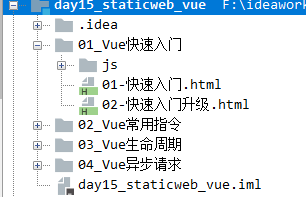
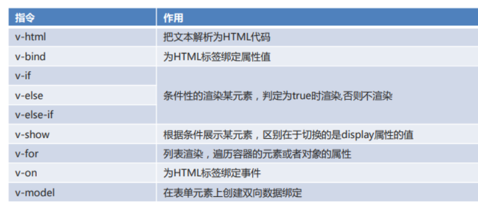
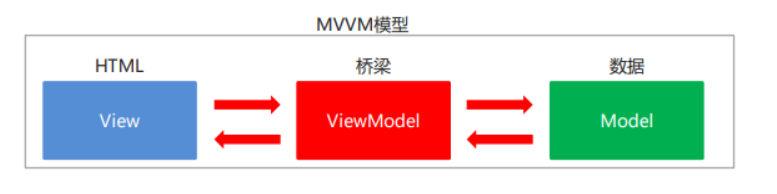
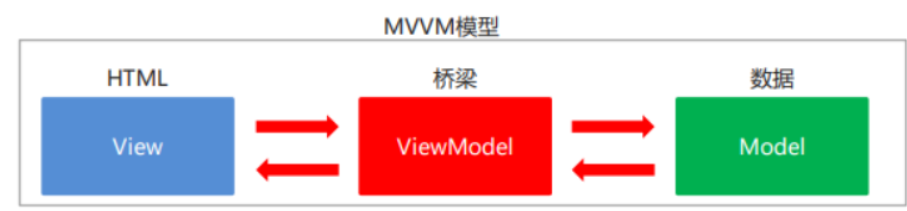
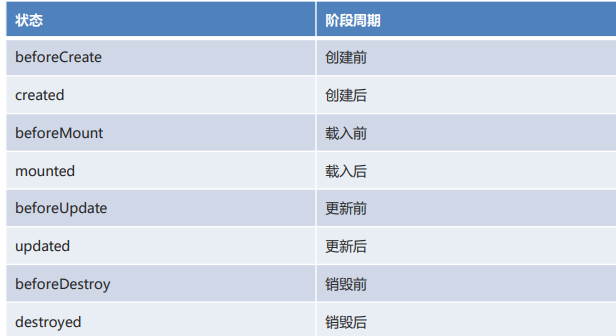
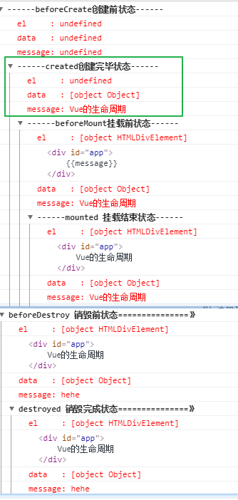
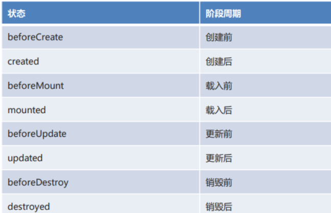
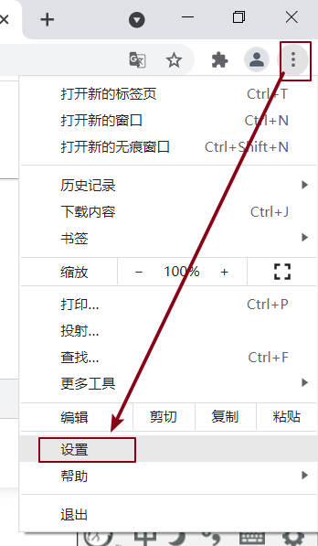
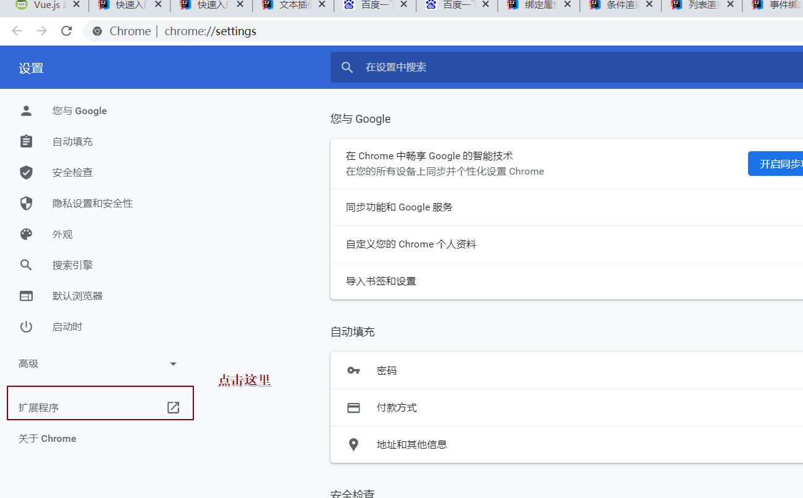
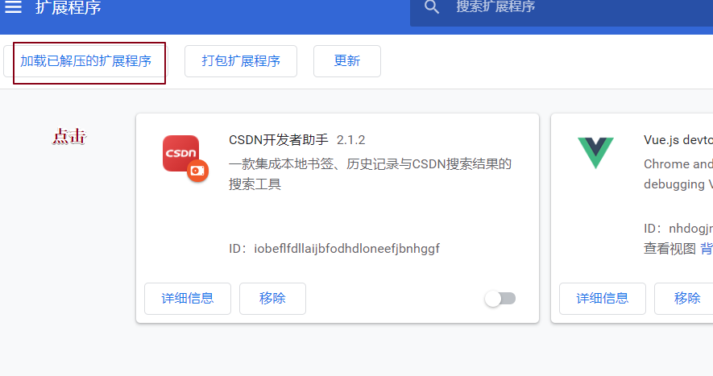

vue的学习网站：

~~~html
https://www.runoob.com/vue2/vue-tutorial.html
~~~

# 回顾

~~~markdown
#1.ajax：完成页面局部刷新，异步交互。

#2.axios发送ajax异步请求：
	1）引入库 <script src=""></script>
	2)axios.get("地址?参数名=参数值&参数名=参数值...").then(resp=>{}).catch(error={}).finally(()=>{});
	3)axios.post("地址","参数名=参数值&参数名=参数值...").then(resp=>{}).catch(error={}).finally(()=>{});
#3.json:用来前后台数据的传输
#4.格式：
	1）{"key":value,"key":value,...}
	2)[{"key":value,"key":value,...},{"key":value,"key":value,...}]
	3){"key":value,"key":[{"key":value,"key":value,...},{"key":value,"key":value,...}],...}
#5.json在js中属于对象，在java中属于json字符串
~~~


# 1.Vue的介绍

## 学习目标

- 说出什么是Vue
- 能够说出Vue的好处
- 能够说出Vue的特点

## 内容讲解

### 【1】Vue介绍

1.vue属于一个前端框架，底层使用原生js编写的。主要用来进行前端和后台服务器之间的一个交互。

2.Vue是一套构建用户界面的渐进式前端框架。

> “渐进式框架”简单的来说你可以将Vue作为你的应用一部分嵌入其中，代理更丰富的交互体验。就是用你想用或者能用的功能特性，你不想用的部分功能可以先不用。Vue不强求你一次性接受并使用它的全部功能特性。

### 【2】Vue好处

**大部分时间关注视图层**，并且非常容易学习，还可以很方便的与其它库或已有项目整合。

> MVC: 
>
> ​	model,  模型层
>
> ​	view,  视图层 在vue中视图就是我们之前学习的html标签
>
> ​	controller 控制层

### 【3】Vue特点

特点
易用：在有HTML,CSS, JavaScript的基础上，快速上手。
灵活：简单小巧的核心，渐进式技术栈，足以应付任何规模的应用。
性能：20kb运行大小、超快虚拟DOM、最省心的优化。

## 内容小结 

1.Vue好处：我们只需要关注视图。操作的代码都是在基于视图来操作。

2.Vue特点：易用  灵活 性能高

3.大部分关注视图：html标签。

4.vue中还具有脚本，就是创建的vue对象，在vue对象中书写一些关于vue的js代码

# 2.Vue的快速入门（掌握）

## 1.基础入门案例1

### 学习目标

- 能够熟悉Vue的基本简单使用步骤
- 掌握Vue的基本结构

### 内容讲解

【1】需求：快速搭建Vue的运行环境，在div视图中获取Vue中的数据

【2】实现步骤：

1.导入vue.js脚本

2.书写代码：

​	视图：我们主要关注视图。html+css

​	脚本：vue的代码，书写数据。

3.将课下资料中的素材导入工程中




~~~html
<!DOCTYPE html>
<html lang="en">
<head>
    <meta charset="UTF-8">
    <meta name="viewport" content="width=device-width, initial-scale=1.0">
    <title>快速入门</title>
</head>
<body>
    <!--需求：快速搭建Vue的运行环境，在div视图中获取Vue中的数据-->
    <!--在vue中html标签称为视图-->
    <div id="myDiv">
        div1
        {{msg}}
    </div>
</body>
<!--导入的vue的js库-->
<script src="js/vue.js"></script>
<script>
    //创建vue对象
    let ve = new Vue({
        //表示vue作用的视图是div标签，根据id选择器来控制视图
        el:"#myDiv",
        //vue中书写的数据
        data:{
            msg:"黑马程序员"
        }
    });
</script>
</html>
~~~

### 内容小结

1.Vue使用的基本步骤

> 1.导入vue的js库
>
> 2.编写视图即html标签
>
> 3.在script标签内部创建Vue对象即脚本

2.Vue的基本结构

> 1.视图：html标签，我们可以在视图中通过**插值表达式**:**{{vue中data中的key}}**获取vue的数据
>
> 2.脚本：
>
> ~~~javascript
>  let 对象名 = new Vue({
>         //表示vue作用的视图是div标签，根据id选择器来控制视图
>         //el是element的缩写，表示作用的视图，通过选择器来获取要作用哪个视图，选择器和之前学习的css选择器一致
>      	//id选择器：#id属性名   class类选择器：.class类的属性值 
>         el:"#myDiv",
>         //vue中书写的数据
>      	//在data中以key:value形式来书写数据，然后在视图中可以通过插值表达式{{key}}获取---{{msg}}
>         data:{
>             msg:"黑马程序员"
>         }
>     });
> ~~~
>
> 

## 2.基础入门案例2(升级版本)

### 学习目标

- 掌握Vue脚本的完整格式
- 能够使用Vue中的函数

### 内容讲解

【1】需求：点击按钮标签执行vue中的函数输出vue中data的数据

【2】实现步骤：

​		1.导入vue.js脚本

​		2.书写代码：

​			视图：我们主要关注视图。html+css

​			脚本：vue的代码，书写数据，定义函数


~~~html
<!DOCTYPE html>
<html lang="en">
<head>
    <meta charset="UTF-8">
    <meta name="viewport" content="width=device-width, initial-scale=1.0">
    <title>快速入门升级</title>
</head>
<body>
<!-- 视图 -->
<div id="div">
    <div>姓名：{{name}}</div>
    <div>班级：{{classRoom}}</div>
    <button onclick="hi()">打招呼</button>
    <button onclick="update()">修改班级</button>
</div>
</body>
<script src="js/vue.js"></script>
<script>
    //脚本
    let ve = new Vue({
        //1.vue作用的视图
        el:"#div",
        //2.vue的数据
        data:{
            name:"锁哥",
            classRoom:"黑马136"
        },
        //3.定义vue中的函数
        methods:{
            //如下是vue中定义函数的写法，如果在vue中(脚本和视图)调用vue中的函数：直接函数名
            //但是如果在vue外部调用必须加vue对象名：vue对象名.函数名(实参)
            vueHi:function () {
                //这里的this表示整个vue对象相当于ve
                //this.name就是获取data中的name值
                //必须书写this
                console.log('姓名:' +this.name);
            },
            //在定义函数,省略了function关键字
            vueUpdate(){
                //修改classRoom的值
                this.classRoom = '312教室';
            }
        }
    });

    ///////////////////////////////下面的两个js函数和vue没有任何关系，就是普通的js函数///////////////////////////////////////
    //在vue外部创建hi函数
    function hi() {
        // console.log('hi....');
        //调用vue中的
        ve.vueHi();
    }
    //在vue外部创建update函数
    function update() {
        // console.log('update....');
        ve.vueUpdate();
    }

</script>
</html>
~~~


### 内容小结

1.vue的整体格式：

~~~js
let 对象名 = new Vue({
    //作用的视图
    el:"视图的选择器",
    //数据
    data:{
        key:value,
        key:value,
        ....
    },
    //函数
    methods:{
        //定义函数
        函数名:function(){
            
        },
        //简写格式
        函数名(){
            
        }
    }
});
~~~


2.如果我们在其他地方调用vue中的函数格式：

~~~js
vue对象名.函数名();
~~~


3.vue中的注意事项：this

**this在vue表示当前vue对象。建议加this**


# 3.Vue 常用指令(掌握)

## 1.Vue 常用指令介绍

### 学习目标

- 理解什么是Vue 指令
- 掌握如何使用Vue指令
- 能够说出常见的Vue指令

### 内容讲解

【1】Vue 指令介绍

在vue中指令是作用在视图中的即html标签，可以在视图中增加一些指令来设置html标签的某些属性和文本。

指令都是以带有 v- 前缀的特殊属性。

【2】使用Vue指令

使用指令时，通常编写在标签的属性上，值可以使用 JS 的表达式。

【3】常见的Vue指令



### 内容小结

1.使用Vue指令注意事项

1）就是vue中的常见指令都是必须书写在html标签的属性中，在属性值中书写js代码。

2）vue中的指令只能使用在视图中，不能使用在脚本。


## 2.文本插值v-html

### 学习目标

- 能够使用文本插值
- 理解文本插值和插值表达式区别

### 内容讲解

【1】文本插值使用格式

~~~html
<标签名 v-html="vue中data的key"></标签名>
说明：文本插值v-html通过data的key获取value显示标签的文本中
~~~

【2】需求：使用文本插值v-html和插值表达式**{{}}**获取vue中data数据

【3】步骤：

> 1.在素材中找到文本插值的代码
>
> 2.使用文本插值获取vue中的数据
>
> 3.打开浏览器查看结果

【4】代码实现:

~~~html
<!DOCTYPE html>
<html lang="en">
<head>
    <meta charset="UTF-8">
    <meta name="viewport" content="width=device-width, initial-scale=1.0">
    <title>文本插值</title>
</head>
<body>
<!--视图-->
<div id="div">
    <div>{{msg}}</div>
    <!--使用文本插值指令：v-html-->
    <div v-html="msg"></div>
    <div v-text="msg"></div>
</div>
</body>
<script src="js/vue.js"></script>
<script>
    //脚本
    new Vue({
        el:"#div",
        data:{
            msg:"<h1>Hello Vue</h1>"
        }
    });
</script>
</html>
~~~


### 内容小结

1.使用文本插值，v-html 用来获取vue中的数据，将数据放到标签的文本中，并且解析标签。

~~~html
<标签名 v-html="data中的key"></标签名>
~~~

2.v-html于v-text和插值表达式的区别

> **1.v-html称为文本插值，属于指令，解析html标签**
>
> 2.插值表达式：{{data中的key}},不解析html标签
>
> 3.v-text：属于指令，但是不解析html标签 了解


## 3.绑定属性  v-bind:属性名或者    :属性名  (重点)

### 学习目标

- 能够使用绑定属性的完整写法和简写

### 内容讲解

【1】绑定属性格式

~~~html
完整写法
<标签名 v-bind:属性名="data中key"></标签名>
简写：常用 *****
<标签名 :属性名="data中key"></标签名>
~~~

【2】需求：给html标签绑定属性

【3】步骤：

> 1.在素材中找到绑定属性的代码
>
> 2.给html标签绑定属性，获取vue的data值作为属性值
>
> 3.打开浏览器查看结果

【4】代码实现:

~~~html
<!DOCTYPE html>
<html lang="en" xmlns:v-bind="http://www.w3.org/1999/xhtml" xmlns:v-on="http://www.w3.org/1999/xhtml">
<head>
    <meta charset="UTF-8">
    <meta name="viewport" content="width=device-width, initial-scale=1.0">
    <title>绑定属性</title>
    <style>
        .my{
            border: 1px solid red;
        }
    </style>
</head>

<body>
    <div id="div">
        <!--
            插件表达式不能写在属性中
        -->
        <a href="{{url}}">百度一下</a>

        <br>
        <!--
            v-bind：为 HTML 标签绑定属性值
        -->
        <a v-bind:href="url">百度一下</a>
        <br>
        <!--
            v-bind 可以省略不写
        -->
        <a :href="url">百度一下</a>
        <br>
        <!--
            也可以绑定其他属性
            给当前div标签绑定一个class属性，属性值通过data中的keycls获取到my，
            这里相当于
             <div class="my">我是div</div>
        -->
        <div :class="cls">我是div</div>
    </div>
</body>
<script src="js/vue.js"></script>
<script>
    new Vue({
        el:"#div",
        data:{
            url:"http://www.baidu.com",
            cls:"my"
        }
    });
</script>
</html>
~~~

### 内容小结

1.绑定属性格式：

~~~html
完整写法：
<标签名 v-bind:属性名="data中的key"></标签名>
简写：重点记忆
<标签名 :属性名="data中的key"></标签名>
~~~

## 4.条件渲染v-if

### 学习目标

- 能够使用条件渲染v-if

### 内容讲解

【1】条件渲染v-if格式

~~~html
<标签名 v-if="条件表达式">满足条件显示的内容</标签名>
<标签名 v-else-if="条件表达式">满足条件显示的内容</标签名>
.......
<标签名 v-else>上述条件都不满足执行的内容</标签名>
~~~


【2】需求：判断vue中data的某个变量的值，对3取余，余数为0显示div1，余数为1显示div2，否则显示div3

【3】步骤

> 1.在素材中找到条件渲染的代码
>
> 2.在html中获取vue中data的数据并判断，显示结果
>
> 3.打开浏览器查看结果

【4】代码实现

~~~html
<!DOCTYPE html>
<html lang="en">
<head>
    <meta charset="UTF-8">
    <meta name="viewport" content="width=device-width, initial-scale=1.0">
    <title>条件渲染</title>
</head>
<body>
    <div id="div">
        <!-- 判断num的值，对3取余
            余数为0显示div1
            余数为1显示div2
            余数为2显示div3 -->
        <div v-if="num % 3 == 0">div1</div>
        <div v-else-if="num % 3 == 1">div2</div>
        <!--注意：如果不满足上述条件，则执行v-else，这里不用书写判断条件-->
        <div v-else>div3</div>


    </div>
</body>
<script src="js/vue.js"></script>
<script>
    new Vue({
        el:"#div",
        data:{
            num:2,
           flag:true
        }
    });
</script>
</html>
~~~


### 内容小结

1.条件渲染：v-if

~~~html
<标签名 v-if="条件表达式">如果条件表达式为true则执行文本内容，如果为false则向下继续判断</标签名>
<标签名 v-else-if="条件表达式">如果条件表达式为true则执行文本内容，如果为false则向下继续判断</标签名>
....
<标签名 v-else>如果上述条件都为false则执行该文本</标签名>
注意：v-else，这里不用书写判断条件
~~~


## 5.条件渲染v-show

### 学习目标

- 能够使用条件渲染v-show
- 能够说出v-show和v-if区别

### 内容讲解

【1】条件渲染v-show格式

~~~html
<标签名 v-show="data中的key">文本</标签名>
说明：
1.如果data中的key的值是true，则显示标签文本内容，如果是false则不显示标签文本内容
~~~

【2】需求：获取Vue中data的布尔类型数据并显示

【3】步骤：

> 1.在素材中找到条件渲染的代码
>
> 2.在html中获取vue中data的数据并判断，显示结果
>
> 3.打开浏览器查看结果

【4】代码实现

~~~html
<!DOCTYPE html>
<html lang="en">
<head>
    <meta charset="UTF-8">
    <meta name="viewport" content="width=device-width, initial-scale=1.0">
    <title>条件渲染</title>
</head>
<body>
<div id="div">
    
    <!--v-show指令-->
    <div v-show="flag">div4</div>

    <!--
       v-if  v-show 他们俩虽然都是控制元素是否显示，但是底层的原理不一样
           v-if 如果条件为false，页面中根本没有这个元素
           v-show如果条件为false，页面中有这个元素只不过它的display属性值为none
   -->
</div>
</body>
<script src="js/vue.js"></script>
<script>
    new Vue({
        el: "#div",
        data: {
            num: 2,
            flag: false
        }
    });
</script>
</html>
~~~


### 内容小结

1.条件渲染v-show

~~~html
<标签名 v-show="data中的key"></标签名>
~~~

2.v-show和v-if区别

> 1.v-if：如果条件不满足，那么在页面中没有任何标签内容，直接删除
>
> 2.v-show:如果条件不满足，是通过设置css样式的属性display，设置属性值为none来隐藏标签，标签还在页面中，只是我们看不见


## 6.列表渲染 v-for

### 学习目标

- 掌握如何使用v-for指令


### 内容讲解

【1】格式

~~~html
增强for循环：掌握
for(int x : arr){}
<标签名 v-for="x in 数组或者对象名或者集合名">
     {{x}} 使用插值表达式获取元素
</标签名>

普通for循环：了解
<标签名 v-for="(x,index) in 数组或者对象名">
   元素:{{x}},索引:{{index}}
</标签名>
说明：x和index属于标识符
~~~

【2】作用：

遍历数组或者对象

【3】代码演示

~~~html
<!DOCTYPE html>
<html lang="en">
<head>
    <meta charset="UTF-8">
    <meta name="viewport" content="width=device-width, initial-scale=1.0">
    <title>列表渲染</title>
</head>
<body>
    <div id="div">
        <ul>
            <!--
               类似于增强for循环
               1. element是遍历得到的每一个元素(变量名可以自定义)
                   有一个作用域,它的作用于在当前的这个循环中
               2. names 是被遍历的数组或对象
               3.我们在标签文本中使用插值表达式根据遍历数组的每个元素的变量element获取对应数据
              -->
            <!--需求：遍历names数组-->
            <li v-for="element in names">
                {{element}}
            </li>
            <!--需求：遍历对象student-->
            <!--
                1.stu 表示对象中的每组数据 :张三 23
                2.student表示遍历的对象名
            -->
            <li v-for="stu in student">
                {{stu}}
            </li>
            <!--
                类似于普通for循环(了解)
            -->
            <!--需求：遍历names数组-->
            <!--
                1.element表示数组的元素
                2.index表示数组中的索引
            -->
            <li v-for="(element,index) in names">
                元素:{{element}},索引:{{index}}
            </li>
            <!--需求：遍历对象student-->
            <!--
                结果：
                元素:张三,索引:name
                元素:23,索引:age
                注意：在vue中使用v-for遍历对象时，使用普通for循环遍历，索引是对象中的key或者变量
            -->
            <li v-for="(element,index) in student">
                元素:{{element}},索引:{{index}}
            </li>
        </ul>
    </div>
</body>
<script src="js/vue.js"></script>
<script>
    new Vue({
        el:"#div",
        data:{
            //数组
            names:["张三","李四","王五"],
            //对象
            student:{
                name:"张三",
                age:23
            }
        }
    });
</script>
</html>
~~~


### 内容小结

1.列表渲染主要用来遍历容器或者对象

**2.使用格式：掌握**

~~~html
类似于增强for：
<li v-for="元素 in 容器名或者对象名">
	{{元素}}
</li>
~~~

说明：取出列表渲染中的元素使用插值表达式。

3.使用格式：了解

~~~html
<li v-for="(元素,索引) in 容器名或者对象名">
	{{元素}}
</li>
~~~

说明：如果遍历的是对象，那么会将对象中的key作为索引返回。


## 7.事件绑定 v-on:事件名或者@事件名(重点)

### 学习目标

- 掌握vue视图的事件绑定


### 内容讲解

【1】格式

~~~html
<标签名 v-on:事件名="调用的是vue中的js函数"></标签名>
简写：掌握
<标签名 @事件名="调用的是vue中的js函数"></标签名>
说明：
1.在vue中绑定的事件名都是将原生js的事件名去掉on:click  blur...
~~~

【2】需求：给视图绑定事件

【3】代码实现

~~~html
<!DOCTYPE html>
<html lang="en" xmlns:v-on="http://www.w3.org/1999/xhtml">
<head>
    <meta charset="UTF-8">
    <meta name="viewport" content="width=device-width, initial-scale=1.0">
    <title>事件绑定</title>
</head>

<body>
    <div id="div">
        <div>{{name}}</div>

        <!--
            v-on：为 HTML 标签绑定事件
        -->
        <button onclick="fn();">以前方式_单击_改变div的内容</button>
        <!--
            1.v-on:click="change();" 给当前标签即视图绑定一个单击事件，在事件的属性值中直接调用vue中的函数change()
        -->
        <button v-on:click="change();">单击_改变div的内容</button>
        <button v-on:dblclick="change();">双击_改变div的内容</button>

        <button @click="change();">简写_改变div的内容</button>
    </div>
</body>
<script src="js/vue.js"></script>
<script>
    let ve = new Vue({
        el:"#div",
        data:{
            name:"黑马程序员"
        },
        methods:{
            change(){
                this.name = "传智播客";
            }
        }
    });

    //定义原生js函数
    function fn() {
        //调用vue中的函数change
        ve.change();
    }
</script>
</html>
~~~


### 内容小结

1.vue的事件绑定：

~~~html
 <button v-on:事件名="调用vue中的函数">xxx</button>
简写： 经常使用
 <button @事件名="调用vue中的函数">xxx</button>
~~~

2.vue中使用的事件名是将原生js中的事件名中的on给去掉


## 8.表单绑定v-model(重点) 非常重要

### 学习目标

- 能够使用v-model表单绑定指令
- 能够理解v-model表单绑定指令的作用

### 内容讲解

【1】v-model表单绑定作用：

可以实现双向数据绑定：

~~~html
1）vue中的data数据更改，然后视图中的显示内容也会随着改变
2）视图中的内容改变，vue中的data数据也会随着改变
~~~

单向数据绑定：

~~~html
vue中的data数据更改，然后视图中的显示内容也会随着改变
~~~

【2】v-model表单绑定实现双向数据绑定的原理：

**MVVM模型(Model,View,ViewModel)：是MVC模式的改进版** 
在前端页面中，JS对象表示Model，页面表示View，两者做到了最大限度的分离。
将Model和View关联起来的就是ViewModel，它是桥梁。
ViewModel负责把Model的数据同步到View显示出来，还负责把View修改的数据同步回Model。



【3】

在vue中实现双向数据绑定使用表单绑定：v-model.

~~~html
<!DOCTYPE html>
<html lang="en" xmlns:v-bind="http://www.w3.org/1999/xhtml">
<head>
    <meta charset="UTF-8">
    <meta name="viewport" content="width=device-width, initial-scale=1.0">
    <title>表单绑定</title>
</head>
<body>
    <div id="div">
        <form autocomplete="off">
            <!--
                单向绑定
            -->
            <!--
                :value="username" 表示给当前input标签绑定value属性，username是vue中data的key
            -->
            姓名_单向绑定：<input type="text" name="username" :value="username">
            <br>
            <!--
                双向绑定
                1.v-model="username":表示给当前input标签进行双向数据绑定，显示到输入框中，
                直接根据key即username获取value
            -->
            姓名_双向绑定：<input type="text" name="username" v-model="username">
            <br>
            年龄：<input type="number" name="age" v-model="age">
            性别:<input type="text" name="gender" v-model="gender">

        </form>
            {{username}}
        <hr>
    </div>
</body>
<script src="js/vue.js"></script>
<script>
    new Vue({
        el:"#div",
        data:{
            username:"张三",
            age:23,
            gender:"男"
        }
    });
</script>
</html>
~~~

### 内容小结

**1.表单绑定：v-model可以实现双向数据绑定。**

2.双向数据绑定：



~~~html
vue中的data数据改变，视图也会随着改变 --- 单向绑定
视图改变，vue中的data中的数据也会改变
~~~

3.使用格式：

~~~html
姓名_双向绑定：<input type="text" name="username" v-model="data中的变量名">
~~~


## 9.指令小结

1.文本插值：将data中的变量名表示的值解析到文本中

注意：可以解析html标签

~~~html
<div v-html="data中的变量名"></div>
<div v-html="username"></div>
实现效果：
<div>锁哥</div>
data:{
	username:"锁哥"
}
~~~

2.绑定属性：

~~~html
<input v-bind:属性名="data中的变量名"/> 可以绑定任意属性
简写：使用较多
<input :属性名="data中的变量名" />
~~~

3.条件渲染：

~~~html
<li v-if="条件表达式">文本1</li>
<li v-else-if="条件表达式">文本2</li>
....
<li v-else>文本</li>


<li v-show="条件表达式">文本</li>
如果条件表达式为true则显示文本，为false则给标签添加css样式即display:none 隐藏
~~~


4.列表渲染：

~~~html
<li v-for="元素 in 容器或者对象名">
	{{元素}}
</li>

<li v-for="(元素,索引) in 数组名或者对象名">
	{{元素}}
</li>
~~~


5.事件绑定：

~~~html
<button v-on:事件名="调用vue中的函数">
    单击
</button>
简写：经常使用,去掉原生js的事件名中的on
<button @事件名="调用vue中的函数">
    单击
</button>
~~~

**6.表单绑定 ：实现双向数据绑定。视图改变，data数据改变。data数据改变，视图也改变。**

~~~html
<input v-model="data中的变量名"/>
~~~


# 4.Vue的生命周期

### 学习目标

- 能够理解Vue的生命周期
- 掌握created生命周期使用

### 内容讲解

【1】vue生命周期状态介绍




重点掌握生命周期函数：created,表示vue对象创建后。**数据准备好了，视图还没有准备**。

我们一般在created生命周期函数中书写向后台加载数据的代码。

【2】代码实现

~~~html
<!DOCTYPE html>
<html lang="en">
<head>
    <meta charset="UTF-8">
    <meta name="viewport" content="width=device-width, initial-scale=1.0">
    <title>生命周期</title>
    <script src="js/vue.js"></script>
</head>
<body>
<div id="app">
    {{message}}
</div>
</body>
<script>
    let vm = new Vue({
        el: '#app',
        data: {
            message: 'Vue的生命周期'
        },
        //vue对象创建前，所有内容都是未定义类型
        beforeCreate: function () {
            console.group('------beforeCreate创建前状态------');
            console.log("%c%s", "color:red", "el     : " + this.$el); //undefined
            console.log("%c%s", "color:red", "data   : " + this.$data); //undefined
            console.log("%c%s", "color:red", "message: " + this.message);//undefined
        },
        //表示vue对象创建完毕
        //我们可以在该生命周期中先准备好数据，然后视图此时还没准备好
        created: function () {
            console.group('------created创建完毕状态------');
            //el的值是undefined说明视图还没有准备好
            console.log("%c%s", "color:red", "el     : " + this.$el); //undefined
            //说明在该生命周期中数据已经准备好了，
            console.log("%c%s", "color:red", "data   : " + this.$data); //已被初始化
            console.log("%c%s", "color:red", "message: " + this.message); //已被初始化
        },
        //就是vue挂载视图前，还没有将数据挂载到视图中
        beforeMount: function () {
            console.group('------beforeMount挂载前状态------');
            console.log("%c%s", "color:red", "el     : " + (this.$el)); //已被初始化
            console.log(this.$el);
            console.log("%c%s", "color:red", "data   : " + this.$data); //已被初始化
            console.log("%c%s", "color:red", "message: " + this.message); //已被初始化
        },
        //就是vue挂载视图后，vue中的data数据已经挂载到视图中了
        mounted: function () {
            console.group('------mounted 挂载结束状态------');
            console.log("%c%s", "color:red", "el     : " + this.$el); //已被初始化
            console.log(this.$el);
            console.log("%c%s", "color:red", "data   : " + this.$data); //已被初始化
            console.log("%c%s", "color:red", "message: " + this.message); //已被初始化
        },
        //表示更新前 必须有数据的更新才会执行该生命周期
        beforeUpdate: function () {
            console.group('beforeUpdate 更新前状态===============》');
            let dom = document.getElementById("app").innerHTML;
            console.log(dom);
            console.log("%c%s", "color:red", "el     : " + this.$el);
            console.log(this.$el);
            console.log("%c%s", "color:red", "data   : " + this.$data);
            console.log("%c%s", "color:red", "message: " + this.message);
        },
        //更新完成
        updated: function () {
            console.group('updated 更新完成状态===============》');
            let dom = document.getElementById("app").innerHTML;
            console.log(dom);
            console.log("%c%s", "color:red", "el     : " + this.$el);
            console.log(this.$el);
            console.log("%c%s", "color:red", "data   : " + this.$data);
            console.log("%c%s", "color:red", "message: " + this.message);
        },
        //销毁前
        //必须执行销毁方法才可以执行该生命周期
        beforeDestroy: function () {
            console.group('beforeDestroy 销毁前状态===============》');
            console.log("%c%s", "color:red", "el     : " + this.$el);
            console.log(this.$el);
            console.log("%c%s", "color:red", "data   : " + this.$data);
            console.log("%c%s", "color:red", "message: " + this.message);
        },
        //销毁后
        destroyed: function () {
            console.group('destroyed 销毁完成状态===============》');
            console.log("%c%s", "color:red", "el     : " + this.$el);
            console.log(this.$el);
            console.log("%c%s", "color:red", "data   : " + this.$data);
            console.log("%c%s", "color:red", "message: " + this.message);
        }
    });


    // 更新data中message数据值
    vm.message = "hehe";

    // 销毁Vue对象
    vm.$destroy();
    vm.message = "hehe";// 销毁后 Vue 实例会解绑所有内容,更新无效
</script>
</html>
~~~

【3】运行效果



【4】created生命周期应用场景：

表示数据已经准备好了，但是视图还没有准备。

我们在该生命周期中可以进行准备数据即可，然后在后面的生命周期mounted挂载后会将之前准备好的数据自动挂载到视图中。

~~~html

<!DOCTYPE html>
<html lang="en">
<head>
    <meta charset="UTF-8">
    <meta name="viewport" content="width=device-width, initial-scale=1.0">
    <title>生命周期</title>
    <script src="js/vue.js"></script>
</head>
<body>
<div id="app">
    {{message}}
    <div v-for="user in list">
        {{user}}
    </div>

    <hr>
</div>
</body>
<script>

    new Vue({
        el:"#app",
        data:{
            message:"好友列表",
            list:[] //用户信息的集合
        },
        methods:{
            queryUsers(){
                //向后台发起查询，将查询数据放到data中list中
                //模拟后台查询用户数据放到list中
                this.list=["张三","李四","王五"];
                console.log("呵呵")
            }
        },

        //vue实例创建完成后要来执行的一个生命周期的方法
        created(){
            //一般我们在这个方法中去对数据进行初始化，比如调用queryUsers方法从后台查询初始数据对list变量赋值
            this.queryUsers();
        }
    });
</script>
</html>
~~~


### 内容小结

1.vue的生命周期有八个阶段



2.掌握created生命周期，表示对象创建后，我们可以在该生命周期中进行准备数据，此时视图还没有准备好，当执行到mounted生命周期的时候就会将准备好的数据挂载到视图中

# 5.  Vue异步操作

## 1 axios介绍

- **在Vue中发送异步请求，本质上还是AJAX。我们可以使用axios这个插件来简化操作！**

- **使用步骤**
  1.引入axios核心js文件。
  2.调用axios对象的方法来发起异步请求。
  3.调用axios对象的方法来处理响应的数据。

- **axios常用方法**

   

- **代码实现**

  - **html代码**

  ```html
  <!DOCTYPE html>
  <html lang="en">
  <head>
      <meta charset="UTF-8">
      <title>异步操作</title>
      <script src="js/vue.js"></script>
      <!--
          引入axios核心js文件
      -->
      <script src="js/axios-0.18.0.js"></script>
  </head>
  <body>
  <div id="div">
      {{name}}
      <!--全称写法 v-on:click="send()"   -->
      <button @click="send()">发起请求</button>
  </div>
  </body>
  <script>
      new Vue({
          el:"#div",
          data:{
              name:"张三",
              age:18
          },
          methods:{
              send(){
                  //1.发送异步请求
                  /*
                      说明：
                          1.后台url的地址   "http://localhost:8080/axiosDemo01Servlet"
                  */
                  axios.get("http://localhost:8080/axiosDemo01Servlet")
                       .then(resp=>{
                           console.log(resp.data);
                       });
              }
          }
      });
  </script>
  </html>
  ```
  
  - **java代码** 后续后讲解，这里不用理会
  
  ```java
  package com.itheima.sh.a_vue_axios_01;
  
  import javax.servlet.ServletException;
  import javax.servlet.annotation.WebServlet;
  import javax.servlet.http.HttpServlet;
  import javax.servlet.http.HttpServletRequest;
  import javax.servlet.http.HttpServletResponse;
  import java.io.IOException;
  
  @WebServlet("/axiosDemo01Servlet")
  public class AxiosDemo01Servlet extends HttpServlet {
      protected void doPost(HttpServletRequest request, HttpServletResponse response) throws ServletException, IOException {
          doGet(request, response);
      }
  
      protected void doGet(HttpServletRequest request, HttpServletResponse response) throws ServletException, IOException {
          System.out.println("hello vue");
          response.getWriter().print("你好vue");
      }
  }
  
  ```

## 2 案例练习

案例: 点击登录时将用户信息提交到后台，并接收后台服务器响应的好友信息显示到页面上。


```html
<!DOCTYPE html>
<html lang="en">
<head>
    <meta charset="UTF-8">
    <title>异步请求案例</title>
    <script src="js/vue.js"></script>
    <script src="js/axios-0.18.0.js"></script>

</head>
<body>
    <!--
    vue
        1. 视图
        2. 脚本
        data改变,视图会随之改变
        我们从服务器获取数据,只要修改data,视图就会改变
        我们无需在js中直接操作视图了
-->
<div id="div">
    <h1>登录页面</h1>
    <!--
        v-model="user.username" :使用双向数据表绑定
    -->
    <input type="text" name="username" placeholder="请输入用户名" v-model="user.username"> <br>
    <input type="password" name="password" placeholder="请输入密码" v-model="user.password"><br>
    <button @click="send()">登录</button>


    <h1>主页: 显示好友列表</h1>
    <ul>
        <li v-for="element in list">
            {{element.id}},{{element.name}},{{element.age}}
        </li>
    </ul>
</div>

</body>
<script>
    new Vue({
        el: "#div",
        data: {
             //TODO; 由于表单双向数据绑定的存在,当用户操作表单时,user就会有数据(json格式)
            user: {},
            list: []
        },
        methods: {
            send: function () {
                //1.当点击登录按钮，向后台发送请求获取好友列表，并将用户名和密码数据提交到后台
                /*
                    说明：
                        1.向后台请求地址：http://localhost:8080/axiosDemo02Servlet
                        2.this.user就是json格式的数据：{"username":"锁哥","password":"1234"}
                */
                axios.post("http://localhost:8080/axiosDemo02Servlet",this.user)//this.user就是json格式的数据：{"username":"锁哥","password":"1234"}
                     .then(resp=>{
                         //2.接收响应数据
                         let obj = resp.data;
                         //3.判断
                         if(obj.flag){
                             //查询成功
                             //4.将后台响应的集合数据赋值给data中的list
                             this.list=obj.valueData;
                         }else{
                             //查询失败
                         }
                     });
            }
        }
    });
</script>
</html>
```

后台代码：（后面学习）

```java
package com.itheima.sh.a_vue_axios_01;


import com.itheima.sh.util.BaseController;

import javax.servlet.ServletException;
import javax.servlet.annotation.WebServlet;
import javax.servlet.http.HttpServlet;
import javax.servlet.http.HttpServletRequest;
import javax.servlet.http.HttpServletResponse;
import java.io.IOException;
import java.util.ArrayList;
import java.util.Collections;

@WebServlet("/axiosDemo02Servlet")
public class AxiosDemo02Servlet extends HttpServlet {
    protected void doPost(HttpServletRequest request, HttpServletResponse response) throws ServletException, IOException {
        doGet(request, response);
    }

    protected void doGet(HttpServletRequest request, HttpServletResponse response) throws ServletException, IOException {
        try {

            //1.创建集合对象保存多个好友
            ArrayList<Friend> list = new ArrayList<>();
            //2.向集合添加数据
            Collections.addAll(list, new Friend("001", "张三", 18), new Friend("002", "李四", 19),
                                new Friend("003", "王五", 20));
            //3.将list放到Result对象中
            Result result = new Result(true, "查询好友成功", list);
            //4.将result对象转换json并响应给前端
            BaseController.printResult(response, result);

        } catch (Exception e) {
            e.printStackTrace();
            try {
                //6.将list放到Result对象中
                Result result = new Result(false, "查询好友失败");
                //7.将result对象转换json并响应给前端
                BaseController.printResult(response, result);
            } catch (Exception exception) {
                exception.printStackTrace();
            }
        }
    }
}

```

```java
package com.itheima01.vue;

import java.io.Serializable;

public class Friend implements Serializable {

    private String id;
    private String name;
    private Integer age;

    public Friend() {
    }

    public Friend(String id, String name, Integer age) {
        this.id = id;
        this.name = name;
        this.age = age;
    }

    public String getId() {
        return id;
    }

    public void setId(String id) {
        this.id = id;
    }

    public String getName() {
        return name;
    }

    public void setName(String name) {
        this.name = name;
    }

    public Integer getAge() {
        return age;
    }

    public void setAge(Integer age) {
        this.age = age;
    }
}

```

```java
package com.itheima01.vue;

import java.io.Serializable;

/*
    javaBean的规范  (java标准实体类)
    1. private属性
    2. public 无参构造
    3. public get/set 方法
    4. 实现serializable接口 (序列化)
 */
public class User implements Serializable {

    private String username;
    private String password;

    public User() {
    }

    public User(String username, String password) {
        this.username = username;
        this.password = password;
    }

    @Override
    public String toString() {
        return "User{" +
                "username='" + username + '\'' +
                ", password='" + password + '\'' +
                '}';
    }
    //TODO: 自己采用字符串拼接的方式输出。
    public String toJson() {
        return "{\"username\":\""+username+"\",\"password\":"+password+"}";
    }
    public String getUsername() {
        return username;
    }

    public void setUsername(String username) {
        this.username = username;
    }

    public String getPassword() {
        return password;
    }

    public void setPassword(String password) {
        this.password = password;
    }
}

```

```java
package com.itheima01.vue;

import java.io.Serializable;

/*
    Result : 结果
 */
public class Result implements Serializable {
    private boolean flag;//执行结果，true为执行成功 false为执行失败
    private String message;//返回结果信息
    private Object data;//返回数据(如果是查询成功则设置,如果是其他情况则不设置)

    public Result() {
    }
    //失败,或者增删改
    public Result(boolean flag, String message){
        this.flag = flag;
        this.message = message;
    }
    //成功的查询
    public Result(boolean flag, String message, Object data) {
        this.flag = flag;
        this.message = message;
        this.data = data;
    }

    public boolean isFlag() {
        return flag;
    }

    public void setFlag(boolean flag) {
        this.flag = flag;
    }

    public String getMessage() {
        return message;
    }

    public void setMessage(String message) {
        this.message = message;
    }

    public Object getData() {
        return data;
    }

    public void setData(Object data) {
        this.data = data;
    }
}


```

```java
package com.itheima01.vue;

import com.alibaba.fastjson.JSON;

import javax.servlet.ServletInputStream;
import javax.servlet.http.HttpServletRequest;
import javax.servlet.http.HttpServletResponse;
import java.io.IOException;

public class BaseController {

    /**
     *  post请求参数为json格式的数据 转换成 javaBean
     */
    public static <T>T getBean(HttpServletRequest request,Class<T> clazz) throws IOException {
        ServletInputStream is = request.getInputStream();
        T t = JSON.parseObject(is, clazz);
        return t;
    }

    public static void printResult(HttpServletResponse response, Result result) throws IOException {
        response.setContentType("application/json;charset=utf-8");
        String json = JSON.toJSONString(result);
        response.getWriter().print(json);
    }
}

```

```xml
<dependencies>
        <dependency>
            <groupId>javax.servlet</groupId>
            <artifactId>javax.servlet-api</artifactId>
            <version>3.1.0</version>
            <scope>provided</scope>
        </dependency>
        <!--fastjson-->
        <dependency>
            <groupId>com.alibaba</groupId>
            <artifactId>fastjson</artifactId>
            <version>1.2.47</version>
        </dependency>
    </dependencies>
```


# 6.es6新语法(高级)

## 1 什么是ES6

> JS语法分三块
>
> 1. ECMAScript : 基础语法 
> 2. BOM  浏览器对象 history location window
> 3. DOM 文档对象  document

编程语言JavaScript是ECMAScript的实现和扩展 。ECMAScript是由ECMA（一个类似W3C的标准组织）参与进行标准化的语法规范。ECMAScript定义了：

[语言语法](https://developer.mozilla.org/en-US/docs/Web/JavaScript/Reference/Lexical_grammar) – 语法解析规则、关键字、语句、声明、运算符等。

[类型](https://developer.mozilla.org/en-US/docs/Web/JavaScript/Data_structures) – 布尔型、数字、字符串、对象等。

[原型和继承](https://developer.mozilla.org/en-US/docs/Web/JavaScript/Inheritance_and_the_prototype_chain)

内建对象和函数的[标准库](https://developer.mozilla.org/en-US/docs/Web/JavaScript/Reference/Global_Objects) – [JSON](https://developer.mozilla.org/en-US/docs/Web/JavaScript/Reference/Global_Objects/JSON)、[Math](https://developer.mozilla.org/en-US/docs/Web/JavaScript/Reference/Global_Objects/Math)、[数组方法](https://developer.mozilla.org/en-US/docs/Web/JavaScript/Reference/Global_Objects/Array)、[对象自省方法](https://developer.mozilla.org/en-US/docs/Web/JavaScript/Reference/Global_Objects/Object)等。

ECMAScript标准不定义HTML或CSS的相关功能，也不定义类似DOM（文档对象模型）的[Web API](https://developer.mozilla.org/en-US/docs/Web/API)，这些都在独立的标准中进行定义。ECMAScript涵盖了各种环境中JS的使用场景，无论是浏览器环境还是类似[node.js](http://nodejs.org/)的非浏览器环境。

ECMAScript标准的历史版本分别是1、2、3、5。

那么为什么没有第4版？其实，在过去确实曾计划发布提出巨量新特性的第4版，但最终却因想法太过激进而惨遭废除（这一版标准中曾经有一个极其复杂的支持泛型和类型推断的内建静态类型系统）。

ES4饱受争议，当标准委员会最终停止开发ES4时，其成员同意发布一个相对谦和的ES5版本，随后继续制定一些更具实质性的新特性。这一明确的协商协议最终命名为“Harmony”，因此，ES5规范中包含这样两句话

> ECMAScript是一门充满活力的语言，并在不断进化中。
>
> 未来版本的规范中将持续进行重要的技术改进

2009年发布的改进版本ES5，引入了[Object.create()](https://developer.mozilla.org/en-US/docs/Web/JavaScript/Reference/Global_Objects/Object/create)、[Object.defineProperty()](https://developer.mozilla.org/en-US/docs/Web/JavaScript/Reference/Global_Objects/Object/defineProperty)、[getters](https://developer.mozilla.org/en-US/docs/Web/JavaScript/Reference/Functions/get)和[setters](https://developer.mozilla.org/en-US/docs/Web/JavaScript/Reference/Functions/set)、[严格模式](https://developer.mozilla.org/en-US/docs/Web/JavaScript/Reference/Strict_mode)以及[JSON](https://developer.mozilla.org/en-US/docs/Web/JavaScript/Reference/Global_Objects/JSON)对象。

ECMAScript 6.0（以下简称ES6）是JavaScript语言的下一代标准，2015年6月正式发布。它的目标，是使得JavaScript语言可以用来编写复杂的大型应用程序，成为企业级开发语言。

可以参考：

http://es6.ruanyifeng.com/

回顾之前的es6语法：

~~~javascript
1.定义变量：let 变量名=数据;
2.定义常量：const 常量名=数据;
3.箭头函数：
	(参数,参数,...)=>{函数体}
4.模板字符串：
	let s="def";
	let s1 = `abc`; 方便拼接字符串
    let s2=`${s}${s1}`;===>`defabc`
   
~~~


## 2. 对象初始化简写

~~~html
<!DOCTYPE html>
<html lang="zh-CN">
<head>
    <meta charset="UTF-8">
    <title>Title</title>
</head>
<body>

</body>
<script>
    //es5
    function people (username,age){//username='Rose',age=18
        return {
            username:username,
            age:age
        }
    }

    //打印
    console.log(people('Rose',18));

    //es6
    function people2 (username,age){
        return {
            //如果key的名字和变量参数名一致，则可以简化写
            username,
            age
        }
    }
    //打印
    console.log(people2('Jack',88));
</script>
</html>
~~~

小结：

创建对象格式：

~~~js
function people2 (name,age){
        return {
            //如果key的名字和变量参数名一致，则可以简化写
            name,
            age
        }
    }
~~~

## 3.解构

~~~html
<!DOCTYPE html>
<html lang="zh-CN">
<head>
    <meta charset="UTF-8">
    <title>Title</title>
</head>
<body>

</body>
<script>
    //目标：从json对象中取值
    const people = {username: 'Rose', age: 18};
    //es5
    //好处，直观；缺点：如果你要取多个值就代码多了一些
    /* let username=people.username;
     let age = people.age;
     console.log(username + ' --- ' + age);*/

    //es6
    //等号左边的大括号中的变量必须和等号右边对象中的key一致
    //例如：等号左边的username，那么等号右边people中的key必须有username
    // const {username,age}=people;
    // const {age,username}=people;
    const {age} = people;
    // console.log(username + "," + age)
    console.log(age);
    //
    //数组
    const color = ['red', 'blue'];
    //es5
    // let first = color[0];
    // console.log(first);//'red'
    // //es6
    //等号左边中括号中的变量随便定义
    const [first,second]=color;
    console.log(first);
    console.log(second);
</script>
</html>
~~~

小结：

解构：就是简化获取对象和数组的数据。

~~~js
1.获取对象：
  const people={username:'Rose',age:18};
  const {username,age}=people;//要求等号左边大括号中的变量必须和等号右边对象中key一致
  console.log(username + "," + age);

2.获取数组：
	 const color = ['red', 'blue'];
	 const [first,second]=color;//等号左边中括号中的变量随便定义
     console.log(first);
     console.log(second);
~~~


## 4. 延展操作符(掌握)

~~~html
<!DOCTYPE html>
<html lang="zh-CN">
<head>
    <meta charset="UTF-8">
    <title>Title</title>
</head>
<body>

</body>
<script>
    //目标：扩展对象的值
    //原来的对象
    const peopleOld={username:'Rose',age:18};
    //需要重新生成一个对象，并基于之前的对象扩展
    const peopleNew={...peopleOld,address:'上海'};
    console.log(peopleOld);//{username: "Rose", age: 18}
    console.log(peopleNew);//{username: "Rose", age: 18, address: "上海"}

    //原来的数组
    const colorOld=['red', 'yellow'];
    //需要重新生成一个数组，并基于之前的数组扩展
    const colorNew=[...colorOld,'blue','green'];
    console.log(colorOld);//["red", "yellow"]
    console.log(colorNew);// ["red", "yellow", "blue", "green"]
</script>
</html>
~~~

小结：

作用：对原来的js对象和数组进行数据的扩展。

~~~js
1.扩展js对象：
	const peopleOld={username:'Rose',age:18};
	const peopleNew={...peopleOld,address:'上海'};
2.扩展数组：
	const colorOld=['red', 'yellow'];
	const colorNew=[...colorOld,'blue'];
~~~


## 5. import 和 export【重点】

模块功能主要由两个命令构成：`export`和`import`。`export`命令用于规定模块的对外接口，`import`命令用于输入其他模块提供的功能。

在ES6中每一个模块即是一个文件，在文件中定义的变量，函数，对象在外部是无法获取的。如果你希望外部可以读取模块当中的内容，就必须使用export来对其进行暴露（输出）,然后以import的形式将这个变量进行引入

import导入模块、export导出模块

lib.js

```js
// 方式1
let add=function(){
    console.log('add...');
}
let remove=function(){
    console.log('remove...');
}
export {add,remove}


// 方式2： 还可以写成
// export default {
//     add(){
//         console.log('add...');
//     },
//     remove(){
//         console.log('remove...');
//     }
// }
```

demo09.js

```js
// 方式1
import {add,remove} from './lib.js';
add();
remove();

//方式2：  还可以写成
// import jsApi from './lib.js'  // 使用这种方式 ，必须要使用export default {} 导出
// jsApi.add()
// jsApi.remove()
```

html

```html
<!DOCTYPE html>
<html lang="en">
<head>
    <meta charset="UTF-8">
    <title>Title</title>
</head>
<body>

</body>

<script  type="module" src="js/demo09.js"></script>

</html>
```

小结：

> 1.使用导入导出的好处是我们可以将上述lib.js理解为源码，然后在demo09.js文件中导入源码的内容并使用，使用起来较方便
>
> 2.对于在html文件中使用<script  type="module" src="js/demo09.js"></script>标签引入具有导入导出的js代码，要求必须书写type="module"属性，表示模块化，因为在js中导入导出只能使用在模块化中
>
> 3.引入模块化就是为了降低系统的可维护性，把成本降低，把一个复杂的项目解耦成为一个细小单一的模块，这样好维护好开发出现问题也可以快速的锁定。可以将上述不同的代码书写在不同的模块中的js文件中就是模块化思想
>
> 4.使用vscode演示导入和导出模块化报错解决方案：
>
> 
>
> 说明：主要是加载js文件时使用了file协议，该协议会导致跨域，而使用http、https等协议时则没有跨域问题。
>
> 解决方案：在vscode中安装插件Live Server（这是一个具有实时重载功能的小型开发服务器。用它来热加载你的HTML / JavaScript / CSS文件），主要是有了live server之后就不在vscode中使用file协议，直接使用live server打开不会涉及到跨域问题
>
> 


# 扩展：在谷歌浏览器中安装插件

1.




2.



3.



4.插件没有效果


