# Vue脚手架

**学习目标：**

- 理解Node.js基本使用方法
- 理解包资源管理器NPM的使用
- 理解webpack的作用
- 理解 vue-cli 脚手架 (重点)
- Element-UI 组件库

~~~javascript
1.vue的格式：
	new Vue({
        //作用的视图
        el:"id选择器",
        //vue中的数据
        /*data:{
            key:value,
            key:value,
            ...
        }*/
        data(){
            return {
                    key:value,
                    key:value,
                    ...
            }
        },
        //vue的函数
        methods:{
            test01:function(){
                ....
            },
            test02(){
                
            },
                ...
        },
        //生命周期函数
        created(){
            //vue对象创建完毕执行，准备数据，然后数据在mounted的时候挂载到视图上
        }
    });
 2.vue常见指令：
 	1）<标签名 v-html="data中的数据"></标签名> 文本插值，将data中的数据放到标签文本中，解析html标签  插值表达式{{}}不解析html标签，不能使用在属性中
    2）<标签名 v-bind:属性名="data中的数据"></标签名> 简写 <标签名 :属性名="data中的数据"></标签名> 给标签绑定任意属性
    3）<标签名 v-on:事件名="vue中的函数"></标签名> 简写 <标签名 @事件名="vue中的函数"></标签名> 事件名需要去掉on
    4)<标签名 v-model="vue中的数据"></标签名>双向数据绑定，脚本改变，视图改变，视图改变，脚本也改变
    5）<标签名 v-for="变量名 in 容器或者对象名">{{变量名}}</标签名> 循环
    6) <标签名 v-if="判断条件">文本</标签名>
	   <标签名 v-else-if="判断条件">文本</标签名>
		....
       <标签名 v-else>文本</标签名>
	如果满足某个条件，那么就显示文本
    7）<标签名 v-show="判断条件">文本</标签名>如果满足某个条件，那么就显示文本,不满足就隐藏 display:none
~~~


#   1.Node.js

## 1 什么是Node.js

~~~javascript
官网：https://nodejs.org/zh-cn/ 
中文学习网：http://nodejs.cn/learn
~~~

> 1.*Node.js* 是一个基于 Chrome V8 引擎的 JavaScript 运行环境。*Node.js* 使用了一个事件驱动、非阻塞式 I/O 的模型,使其轻量又高效。
>
> 2.前端的底层 html,css和 js, 这些都不需要编译 , 由浏览器解释运行(解释型语言)

> 3.我们可以将Node.js理解成java的 JDK
>
> 4.*Node.js* 的包管理器 npm,是全球最大的开源库生态系统。

​	

小结：Node.js 是一个开源和跨平台的 JavaScript 运行时环境，功能类似于浏览器。

## 2 Node.js安装

1、下载对应你系统的Node.js版本:[https://nodejs.org/en/download/](https://nodejs.org/en/download/)

历史版本：https://nodejs.org/zh-cn/download/releases/

> （我们现在使用的版本是v14.15.2，资料\安装包\2_nodejs 也已提供）

2、选**默认即可**进行安装

> 不要修改安装路径! 不然需要配置环境变量，比较麻烦

3、测试，在命令提示符下输入命令 `node -v`

会显示当前node的版本


## 3 快速入门

### 1 控制台输出

我们现在做个最简单的小例子，演示如何在控制台输出。

课程案例使用 Vscode 软件。

【1】创建 demo1.js 文件，代码内容：

```js
let a=1;
let b=2;
console.log(a+b);
```


【2】在文件上右键，选择在集成终端中打开


【3】我们在命令提示符下输入命令

```shell
node demo1.js
```


### 2 使用函数

创建文本文件demo2.js

```js
function add(a,b){
	return a+b;
}
let c=add(100,200);
console.log(c);
```

命令提示符输入命令

```sh
node demo2.js
```

运行后看到输出结果为300


### 3 模块化编程

> node的exports和require(模块化)
>
> 模块就是文件

创建文本文件demo3_1.js

```js
exports.add=function(a,b){ // 导出
	return a+b;
}
```

创建文本文件demo3_2.js

```js
let demo= require('./demo3_1');  // 导入 ./ 必须书写，表示使用当前路径导入demo3_1文件的内容
console.log(demo.add(400,600));
```

我们在命令提示符下输入命令

```sh
node demo3_2.js
```

结果为1000


# 2 npm 包管理器

## 1 什么是npm

​	npm全称 Node Package Manager，是 Node.js 标准的软件包管理器。

​	在 2017 年 1 月时，npm 仓库中就已有超过 350000 个软件包，这使其成为世界上最大的单一语言代码仓库，并且可以确定几乎有可用于一切的软件包。

它起初是作为下载和管理 Node.js 包依赖的方式，但其现在也已成为前端 JavaScript 中使用的工具。

   `npm` 有很多功能。

> 可以把它看成maven中包依赖管理那部分

## 2 npm命令

### 2.1 初始化工程

init命令是工程初始化命令。

建立一个`npmdemo`空文件夹，在命令提示符进入该文件夹  执行命令初始化

```sh
npm init
```


按照提示输入相关信息，如果是用默认值则直接回车即可。

* name: 项目名称
* version: 项目版本号
* description: 项目描述
* keywords: {Array}关键词，便于用户搜索到我们的项目


最后会生成**package.json**文件，这个是包的配置文件，相当于maven的pom.xml

```json
{
  "name": "npmdemo",
  "version": "1.0.0",
  "description": "",
  "main": "index.js",
  "scripts": {
    "test": "echo \"Error: no test specified\" && exit 1"
  },
  "author": "",
  "license": "ISC"
}
```

我们之后也可以根据需要进行修改。


### 2.2 本地安装(了解)

install命令用于安装某个模块，如果我们想安装express模块（node的web框架），输出命令如下：

```sh
npm install express
```


出现黄色的是警告信息，可以忽略，请放心，你已经成功执行了该命令。

在该目录下已经出现了一个node_modules文件夹 和package-lock.json

* node_modules文件夹用于存放下载的js库（相当于maven的本地仓库）

* package-lock.json是当 node_modules 或 package.json 发生变化时自动生成的文件。这个文件主要功能是确定当前安装的包的依赖，以便后续重新安装的时候生成相同的依赖，而忽略项目开发过程中有些依赖已经发生的更新。

我们再打开package.json文件，发现刚才下载的express已经添加到依赖列表中了。

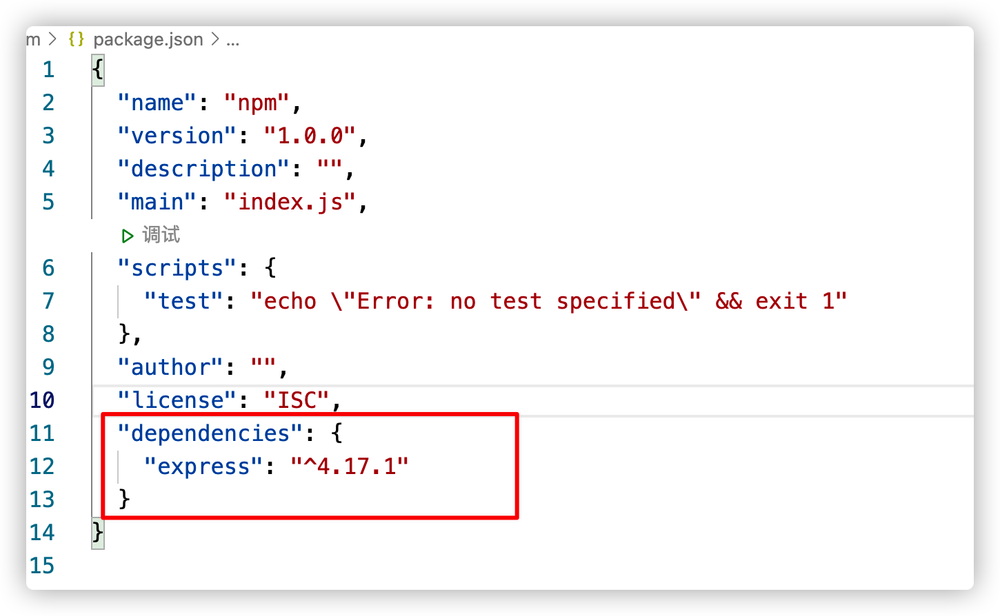

```markdown
# 关于版本号定义：
1. 指定版本：比如 `1.2.2`，遵循 **“大版本.次要版本.小版本”** 的格式规定，安装时只安装指定版本。
2. 波浪号（tilde）+指定版本：比如~1.2.2，表示安装1.2.x的最新版本（不低于1.2.2），但是不安装1.3.x，也就是说安装时不改变大版本号和次要版本号。
3. 插入号（caret）+指定版本：比如ˆ1.2.2，表示安装1.x.x的最新版本（不低于1.2.2），但是不安装2.x.x，也就是说安装时不改变大版本号。需要注意的是，如果大版本号为0，则插入号的行为与波浪号相同，这是因为此时处于开发阶段，即使是次要版本号变动，也可能带来程序的不兼容。
4. latest：安装最新版本。
```


### 2.3 全局安装(掌握)

刚才我们使用的是本地安装，会将js库安装在当前目录(node_modules)，只对当前工程有效, 而使用全局安装会将库安装到你的全局目录下。

如果你不知道你的全局目录在哪里，执行命令

> -g   global 全局

```sh
npm root -g
```

我的全局目录在

~~~java
C:\Users\tians\AppData\Roaming\npm\node_modules
~~~

注意：第一次执行命令npm root -g的时候是找不到node_modules目录，因为之前没有任何安装命令，所以我们直接找到C:\Users\tians\AppData\Roaming\npm目录是可以的，当执行下面的安装命令就会生成node_modules目录

比如我们全局安装vue,  输入以下命令

```sh
npm install vue -g
```

执行完上述命令之后，生成内容如下：


### 2.4 批量下载

我们从网上下载某些代码，发现只有package.json,没有node_modules文件夹，这时我们需要通过命令重新下载这些js库.

进入目录（package.json所在的目录）输入命令

```sh
npm install
```

此时，npm会自动下载package.json中依赖的js库.

### 2.5 淘宝NPM镜像【建议使用】

有时我们使用npm下载资源会很慢，所以我们可以安装一个cnmp(淘宝镜像)来加快下载速度。

输入命令，进行全局安装淘宝镜像。

**注意：需要保证网络畅通。**

```sh
更换成淘宝的源
npm config set registry https://registry.npm.taobao.org 
– 配置后可通过下面方式来验证是否成功 
npm config get registry 

npm install cnpm@7.1.0 -g
```


安装后的效果：


注意：由于在第一次下载的时候会在npm的目录有如下内容：


如果想重新下载需要将其删除之后再重新下载。


安装后，我们可以使用以下命令来查看cnpm的版本

> 如果安装之后有问题, 请查看  资料\问题

```sh
cnpm -v
```

使用cnpm

```sh
cnpm install -g 需要下载的js库
例如：
 cnpm install -g axios
```


### 2.6 运行工程

> 这个待会使用!!!

如果我们想运行某个工程，则使用run命令

如果package.json中定义的脚本如下：

* dev是开发阶段测试运行

* build是构建编译工程

* lint 是运行js代码检测 

```sh
npm run dev
```


### 2.7 编译工程

>这个待会使用!!!

我们接下来，测试一个代码的编译.编译后我们就可以将工程部署到nginx中啦~

编译后的代码会放在dist文件夹中，首先我们先删除dist文件夹中的文件,进入命令提示符输入命令

```sh
npm run build
```

生成后我们会发现只有个静态页面，和一个static文件夹

这种工程我们称之为单页Web应用（single page web application，SPA），就是只有一张Web页面的应用，是加载单个HTML 页面并在用户与应用程序交互时动态更新该页面的Web应用程序。

这里其实是调用了webpack来实现打包的，关于webpack我们后续的章节进行介绍

# 3 Webpack

## 1 什么是Webpack

https://webpack.js.org/ (官网)

webpack 是一个现代 javascript 应用程序的 **静态模块打包器 (module bundler)**

待会要学的 vue-cli 脚手架环境, 集成了 webpack, 所以才能对各类文件进行打包处理

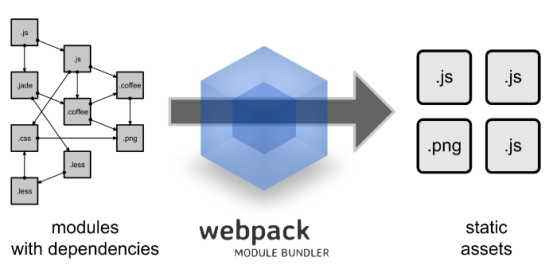 

webpack是一个 静态模块 打包器,可以做以下的这些工作

1. 语法转换(主要是浏览器兼容)

   - less/sass转换成css
   - ES6转换成ES5
   - ...

2. html/css/js 代码压缩合并 (打包)

3. webpack可以在开发期间提供一个开发服务器

   

> 可以把它看成maven中工程自动化那部分(<packaging>jar</packaging>) ,前端项目也是先打包再上线

## 2 Webpack安装

全局安装

```
cnpm install webpack@4.41.5 -g
cnpm install webpack-cli@3.3.12 -g
```

安装后查看版本号

```
webpack -v
webpack-cli -v
```

## 3 快速入门 (js打包)

**方式一：webpack原始方式**

（1）新建文件夹 work3，在创建src文件夹，创建 bar.js

```js
exports.info=function(str){
   document.write(str);
}
```

（2）src下创建logic.js

```js
exports.add=function(a,b){
	return a+b;
}
```

（3）src下创建main.js

```js
var bar= require('./bar');
var logic= require('./logic');
bar.info( 'Hello world!'+ logic.add(100,200));
```

说明：上述具有多个js文件，那么我们在实际开发中使用的时候会导入过多的js文件，使用起来不方便，那么我们可以将上述多个js文件打包成一个js文件。

（4）创建配置文件webpack.config.js  ，该文件与**src处于同级目录**

```js
var path = require("path"); // 导入 node.js 中专门操作路径的模块，固定写法
//执行webpack命令的时候会读取到module.exports中的内容
module.exports = {
    //执行webpack命令的时候,读取入口main.js，由于main.js关联bar.js和logic.js，所以会将这三个js文件合并到一个js文件中
	entry: './src/main.js', // 打包入口文件的路径
    //输出文件位置
	output: {
        //__dirname表示当前工程目录
		path: path.resolve(__dirname, './dist'),  // 输出文件的存放路径
		filename: 'bundle.js'  // 输出文件的名称
	}
};
```

以上代码的意思是：读取当前目录下src文件夹中的main.js（入口文件）内容，把对应的js文件打包，打包后的文件放入当前目录的dist文件夹下，打包后的js文件名为bundle.js

> webpack 的 4.x 版本中默认约定：
>
> * 打包的入口文件为 src  -> main.js
>
> * 打包的输出文件为 dist -> index.js

（5）执行编译命令

```
webpack
```

执行后查看bundle.js 会发现里面包含了上面两个js文件的内容

（6）创建index.html ,引用bundle.js

```html
<!doctype html>
<html>
  <head>  
  </head>
  <body>   
    <script src="dist/bundle.js"></script>
  </body>
</html>`
```

创建完毕,完整目录如下

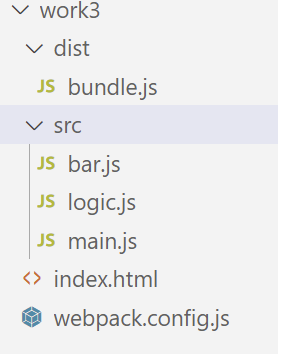 


测试调用index.html，会发现有内容输出：Hello world!300

**方式二：基于NPM方式**

1. 新建项目空白目录，并运行`npm init –y` 命令，初始化包管理配置文件package.json

   > -y 可以直接跳过配置

   

   

2. 新建 src 源代码目录,并且把 bar.js 和 logic.js 和 main.js 文件复制到 src目录

3. 创建index.html ,引用bundle.js

   ```html
   <!doctype html>
   <html>
     <head>  
     </head>
     <body>   
       <script src="dist/bundle.js"></script>
     </body>
   </html>
   ```

4. 运行 `npm install webpack webpack-cli` 命令，安装webpack相关的包

   > 如果全局安装过webpack 和 webpack-cli工具, 此步骤可跳过

5. 在项目根目录中，创建名为webpack.config.js 的 webpack配置文件**同上**

   ```js
   var path = require("path");
   module.exports = {
   	mode: 'development', // mode 用来指定构建模式development、production
   	entry: './src/main.js',
   	output: {
   		path: path.resolve(__dirname, './dist'),
   		filename: 'bundle.js'
   	}
   };
   ```

   >   mode: 'development'    //mode 用来指定构建模式、production：生产模式（压缩）

6. 在 package.json 配置文件中的scripts节点下，新增dev脚本如下：

   ```js
   {
     "name": "work4",
     "version": "1.0.0",
     "description": "",
     "main": "index.js",
     "scripts": {
       "test": "echo \"Error: no test specified\" && exit 1",
       "dev": "webpack"  //script 节点下的脚本，可以通过 npm run 执行
     },
     "keywords": [],
     "author": "",
     "license": "ISC"
   }
   
   ```
   
   完整代码结构：
   
   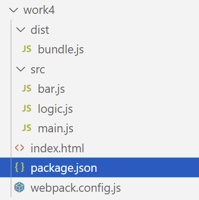 
   
   在终端中运行 `npm run dev` 命令，启动webpack进行项目打包。
   
   
   
   
   
   
   
   注意是在package.json 包下运行该命令
   
   点击index.html文件查看结果, 会发现有内容输出：`Hello world!300
   
   说明：使用npm命令运行的原因是后期使用webpack命令的时候，命令会很多，不仅仅只有webpack几个字母，不好记，而使用：npm run dev命令执行无论webpack命令有多少都会执行。

## 4 webpack-dev-server 开发服务器

### 4.1 介绍

修改main.js代码如下：


需要每次在修改源码之前需要重新打包：

	

每次修改代码, 都需要重新打包, 才能看到最新的效果, 且实际工作中, 打包非常费时 (30s - 60s) 之间

为什么费时? 

1. 构建依赖
2. 读取对应的文件, 才能加载  
3. 用对应的 loader 进行处理  
4. 将处理完的内容, 写入到 dist 目录  

简而言之就是我们希望修改源码完毕之后，不用再每次重新打包，运行的结果直接是修改后的结果。

解决方案：我们可以开启一个开发服务器webpack-dev-server,  **在电脑内存中打包**, 缓存一些已经打包过的内容, 只重新打包修改的文件 **(热更新)**

### 4.2 使用

如果模块(work3)下，没有package.json 文件，那么需要在模块下初始化命令：npm init即可

1. 修改 package.json -> scripts 中的 dev, dependencies,  devDependencies如下：

   > devDependencies这是开发时依赖, 上线不依赖

```js
{
  "name": "work4",
  "version": "1.0.0",
  "description": "",
  "main": "index.js",
  "scripts": {
    "test": "echo \"Error: no test specified\" && exit 1",
    "dev": "webpack-dev-server"
  },
  "keywords": [],
  "author": "",
  "license": "ISC",
  "dependencies": {
    "webpack": "^4.41.5",
    "webpack-cli": "^3.3.12"
  },
  "devDependencies": { 
    "webpack-dev-server": "^3.11.2"
  }
}

```

然后运行 cnpm install 指令,安装webpack,webpack-cli 和 webpack-dev-server


2. 修改 webpack.config.js 文件,添加 devServer

```json
var path = require("path");
module.exports = {
	mode: 'development', // mode 用来指定构建模式development、production
	entry: './src/main.js',
	devServer: {
		port: 8099,// 服务器占用8099端口
		open: true  // 自动打开浏览器
	},
	output: {
		path: path.resolve(__dirname, './dist'),
		filename: 'bundle.js'
	}
};
```

3. 删除之前的dist目录

3. 将 index.html 中，script 脚本的引用路径

   ```html
   <!doctype html>
   <html>
     <head>  
     </head>
     <body>   
       <!-- 内存中读取 -->
       <script src="/bundle.js"></script>
     </body>
   </html>
   ```

   

4. 运行 npm run dev 命令

5. 在浏览器中访问 http://localhost:8099地址，查看自动打包效果

> webpack-dev-server 会启动一个实时打包的 http 服务器
>
> webpack-dev-server 打包生成的输出文件，默认放到了项目根目录中，基于内存

# 4 vue-cli 脚手架(重点)

## 1 脚手架介绍

> `vue-cli`也叫vue脚手架,`vue-cli`是vue官方提供的一个全局命令工具，这个命令可以帮助我们快速的创建一个vue项目的基础架子。
>
> 脚手架：搭建好的一个架子，我们在架子上进行开发

- 开箱即用
- 零配置
- 基于webpack、webpack-dev-server

https://cli.vuejs.org/zh/guide/

## 2 快速入门

Vue CLI >= 3 和旧版使用了相同的 `vue` 命令，所以 Vue CLI 2 (`vue-cli`) 被覆盖了。如果你仍然需要使用旧版本的 `vue init` 功能，你可以全局安装一个桥接工具：

【1】切换到当前项目目录：


> 使用cd 命令切换

【2】在项目目录下执行下面的命令

~~~bash
cnpm install vue-cli -g    # 只需安装一次， 可以使用cnpm安装,通过

# Windows使用 `vue init` 的运行效果将会跟 `vue-cli@2.x` 相同
# work5是模块名字
vue init webpack work5

#Mac 使用
sudo vue init webpack vuedemo

##查看vue版本
vue --version
~~~


- 

效果：


- 


> 如果安装vue脚手架之后, vue init命令无法识别, 可以尝试在vscode在任务管理器中关闭进程,再启动


说明：use ESLint to lint ....表示代码检测，不需要，所以设置为no

- 

注意：时间会长一点，有可能几分钟。

下载成功后如下显示：

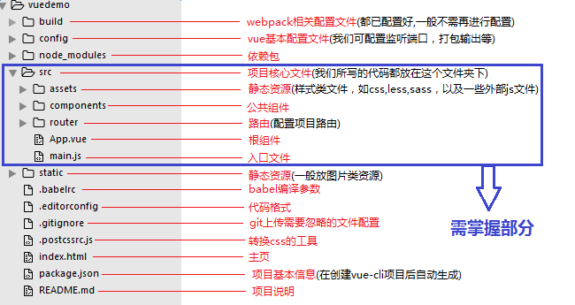

注意：在vue脚手架中文件后缀名是.vue称为组件。App.vue称为根组件。

- 然后到模块目录下运行     (cd 工程名 )


- 

```bash
npm run dev
```


浏览器访问 http://localhost:8080/#/ 

或者在vscode终端中按住ctrl键，点击鼠标左键即可访问，如下：

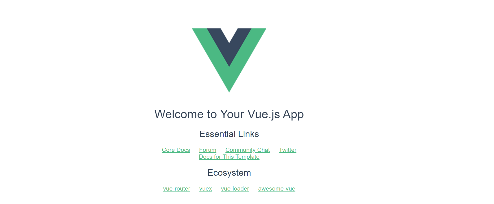 

> - 退出服务器, 两下ctrl+c 
>
> 

## 3 基础介绍

### 3.1 服务器设置

【1】问题：为什么执行上述命令**npm run dev**，就可以使用浏览器访问网址?

> 1.使用npm命令的时候我们首先需要找到vue脚手架中的package.json文件


在该文件中具有webpack-dev-server，它表示开发服务器命令，该命令要读取build目录下的配置文件**webpack.dev.conf.js**


【2】webpack.dev.conf.js文件说明：

> 1.

> 2.webpack.base.conf配置文件：
>
> 

> 3.
>
> 


> conf/index.js
>
> 注意：对于该文件我们必须掌握如何修改开发服务器的几个配置即可，上述的内容了解即可

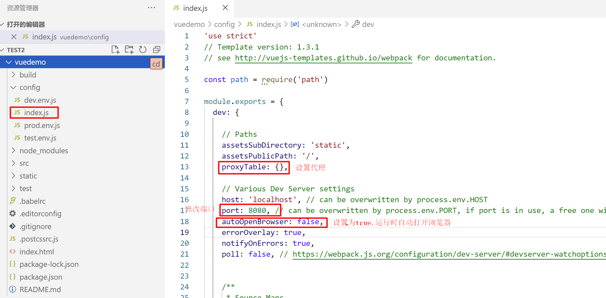

```json
proxyTable: { //代理配置(能够发送跨域请求)
      "/": {
                target: "http://localhost:8080",
                changeOrigin: true
              }
    },

    // Various Dev Server settings
    host: 'localhost', // can be overwritten by process.env.HOST
    port: 8090, //修改成8090避免跟tomcat8080冲突
    autoOpenBrowser: true, // npm run dev 自动打开浏览器
```

【3】修改index.js文件的参数


【4】在终端执行如下命令：


此时就会自动打开浏览器：


小结：


> 说明：最后我们只需要关注config目录下的index.js文件，修改内容如下：
>
> 

### 3.2 目录分析

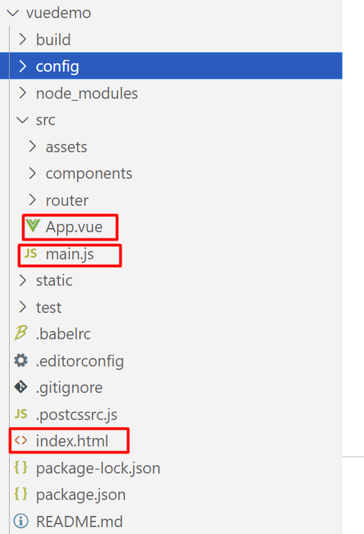

```markdown
1. index.html是页面, 不用动,提供一个最基础的页面
2. src/main.js是入口程序, 不用动, 渲染了App.vue组件
3. src/App.vue是根组件, 默认有很多的内容，可以编辑
```

【1】index.html页面说明

>~~~html
><!DOCTYPE html>
><html>
>  <head>
>    <meta charset="utf-8">
>    <meta name="viewport" content="width=device-width,initial-scale=1.0">
>    <title>work5</title>
>  </head>
>  <body>
>    hello vue
>    <div id="app"></div>
>    hello vue1
>    <!-- built files will be auto injected -->
>  </body>
></html>
>
>~~~
>
>页面效果：
>
>

> 说明：接下来我们要学习如何在index.html页面上使用标签<div id="app"></div>显示如上页面的内容。

【2】main.js

> 1.src/main.js是入口程序, 不用动, 渲染了App.vue组件
>
> 2.main.js文件代码
>
> ~~~javascript
> // The Vue build version to load with the `import` command
> // (runtime-only or standalone) has been set in webpack.base.conf with an alias.
> //vue脚手架需要导入vue
> import Vue from 'vue'
> //导入src下面的App.vue文件
> import App from './App'
> //这里是路由，我们下面讲解，这里先不需要知道
> import router from './router'
> 
> Vue.config.productionTip = false
> 
> /* eslint-disable no-new */
> new Vue({
>   el: '#app',
>   //路由
>   router,
>   //组件
>   components: { App },
>   template: '<App/>'
> })
> 
> ~~~
>
> 

【3】App.vue

> 1.src/App.vue是根组件, 默认有很多的内容，可以编辑
>
> 2.代码

> ~~~vue
> <!--
> 	1.template相当于body标签
> -->
> <template>
>   <div id="app">
>     
>     <router-view/>
>   </div>
> </template>
> <!--书写js代码-->
> <script>
> export default {
>   name: 'App'
> }
> </script>
> <!--书写css代码-->
> <style>
> #app {
>   font-family: 'Avenir', Helvetica, Arial, sans-serif;
>   -webkit-font-smoothing: antialiased;
>   -moz-osx-font-smoothing: grayscale;
>   text-align: center;
>   color: #2c3e50;
>   margin-top: 60px;
> }
> </style>
> 
> ~~~
>
> 


#### vue单文件组件的说明

一个`.vue`文件就是一个组件,后续开发vue，所有的功能都是基于组件实现。

安装插件(.vue文件才会有提示)

注意：vscode默认不支持vue,.vue文件是vue脚手架特有的，不像.html   .css等通用性文件，所以需要安装如下插件

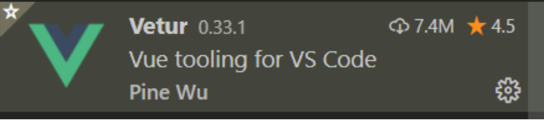 

一个单文件组件由三部分构成

- template(必须)  影响组件渲染的结构  html
  - 只能有一个根元素
- script                     逻辑   js
- style                       样式   css

**案例 App.vue**

```html
<template>
    ·<!--书写html标签，只有一个根标签-->
  <div id="app">
    <!-- 
    <router-view/> -->
    ·<!--插值表达式-->
     <span>{{msg}}</span>
  </div>
</template>

<script>
//书写vue代码
export default {
  data(){
    return {
      msg : "hello vue"
    }
  }
}
 /*
 	以后不用这样书写了
 	new Vue({
 		data(){
 			return {
 				msg:"hello vue"
 			}
 		}
 	});
 */
</script>

<style>
  /*书写css样式*/
  span{
    color : red
  }
</style>
```

小结：

1.template标签中只能有一个根标签


2.在App.vue中以后不用再书写

~~~javascript
new Vue({
 		data(){
 			return {
 				msg:"hello vue"
 			}
 		}
 	});
~~~

直接导出：

~~~javascript
<script>
  export default {
  data(){
    return {
      msg:"hello vue"
    }
  }
  }
</script>
~~~


### 3.3 路由

#### 介绍

前端的路由指的是路径和组件(.vue结尾的文件)的映射关系

【1】


【2】


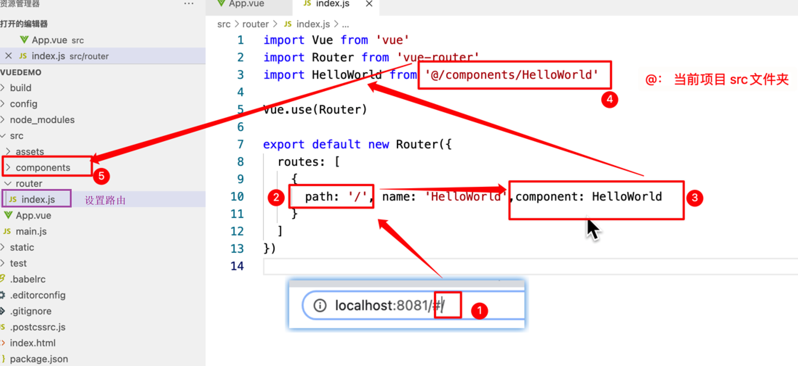 

~~~javascript
import Vue from 'vue'
import Router from 'vue-router'
import HelloWorld from '@/components/HelloWorld'

Vue.use(Router)

export default new Router({
  routes: [
    {
      path: '/', // 这里的路径/映射到组件component的HelloWorld
      name: 'HelloWorld',
      component: HelloWorld
    }
  ]
})

~~~

>1.以上说明 路径 / 映射 组件HelloWorld
>
>2.组件输出位置 用标签<router-view/>


在根组件App.vue中使用<router-view/>标签引入HelloWorld组件内容。


一般组件放在 src/views(或pages) 文件夹 和 src/components文件夹

#### 练习

目的：页面（组件）、路由配置

**需求：模拟网易云音乐**


实现：

1、在src目录下创建 views 文件夹

2、在views文件夹下创建 userList.vue 组件文件


```vue
<template>
	<!--有且只有一个根标签-->
    <div>
         {{name}}
    </div>
</template>

<script>
export default {
    data(){
        return {
            name : "张三"
        }
    }
}
</script>

<style>

</style>
```

3、在 router/index.js 下定义页面路由

```js
import Vue from 'vue'
import Router from 'vue-router'
import HelloWorld from '@/components/HelloWorld'
import userList from '@/views/userList' //引入新的组件

Vue.use(Router)

export default new Router({
  routes: [
    {
      path: '/',
      name: 'HelloWorld',
      component: HelloWorld
    },
    { // 定义组件的路径
      path: '/users',//随便定义,组件路径
      name: 'userlist', //随便定义，组件名
      component: userList //需要和上面的import userList from '@/views/userList' import后面的userList一致
    }
  ]
})

```

说明：至于在根组件App.vue中引入哪个组件由用户在浏览器地址栏上输入哪个组件的路径决定的：


4. 修改根组件App.vue

   ```html
   <template>
     <div id="app">
        
       <!-- 注意：这里需要加# -->
       <a href="#/">发现vue</a>
       <a href="#/users">发现好友</a><br>
   
       <!-- 组件的输出位置 -->
       <router-view/>
   
     </div>
   
   </template>
   
   <script>
   
   </script>
   
   <style>
   
   </style>
   
   ```

   

4、控制台使用 `npm run dev` 运行

浏览器输入 ： http://localhost:8090/#/

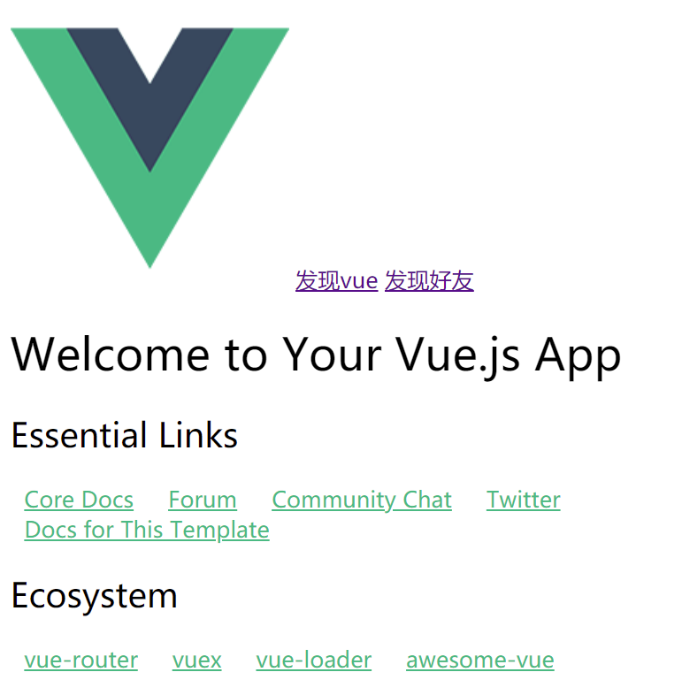 


~~~markdown
# 1.对于index.html和main.js文件我们不需要修改
# 2.main.js文件引入根组件App.vue
# 3.根组件App.vue包含其他组件即components目录或者自己创建的views目录下的组件，组件以 .vue结尾的文件
# 4.修改完组件一定要修改路由
# 5.自己的图片一般存放在static目录下
~~~


# 5 Element-UI组件库

网站快速成型工具[Element](https://element.eleme.cn/2.0/#/zh-CN/component/installation)，一套为开发者、设计师和产品经理准备的基于 Vue 2.0 的桌面端组件库

- 导入素材中的文件

​	

- 在vscode终端输入： `cnpm install命令`

## 1 安装

element官网：

~~~html
https://element.eleme.cn/#/zh-CN/component/installation
~~~


1. 推荐使用 npm 的方式安装，它能更好地和 [webpack](https://webpack.js.org/) 打包工具配合使用。

   ```js
   cnpm i element-ui -S
   ```

   

   

   说明：i是install的首字母。S 是save的首字母

2. 导入Element-UI 相关资源

   

   在main.js中添加如下配置：
   
   ```js
     // 导入组件库
     import ElementUI from 'element-ui';
     // 导入组件相关样式
     import 'element-ui/lib/theme-chalk/index.css';
     // 配置 Vue 插件
     Vue.use(ElementUI);
   ```


## 2 快速入门

需求：实现elementui中的表格

1. 新增 views/elementview.vue

   

   > 这里的内容来自elementui组件使用
   
   ```html
   <template>
     <el-table
       :data="tableData"
       stripe
       style="width: 100%">
       <el-table-column
         prop="date"
         label="日期"
         width="180">
       </el-table-column>
       <el-table-column
         prop="name"
         label="姓名"
         width="180">
       </el-table-column>
       <el-table-column
         prop="address"
         label="地址">
       </el-table-column>
     </el-table>
   </template>
   
   <script>
     export default {
       data() {
         return {
           tableData: [{
             date: '2016-05-02',
             name: '王小虎',
             address: '上海市普陀区金沙江路 1518 弄'
           }, {
             date: '2016-05-04',
             name: '王小虎',
             address: '上海市普陀区金沙江路 1517 弄'
           }, {
             date: '2016-05-01',
             name: '王小虎',
             address: '上海市普陀区金沙江路 1519 弄'
           }, {
             date: '2016-05-03',
             name: '王小虎',
             address: '上海市普陀区金沙江路 1516 弄'
           }]
         }
       }
     }
   </script>
   
   <style>
   
   </style>
   ```

   2. 到router/inidex.js中配置路径
   
      ```js
      import Vue from 'vue'
      import Router from 'vue-router'
      import HelloWorld from '@/components/HelloWorld'
      import userList from '@/views/userList' //引入新的组件
      import ElementView from '@/views/elementView' //引入新的组件
      
      Vue.use(Router)
      
      export default new Router({
        routes: [
          {
            path: '/',
            name: 'HelloWorld',
            component: HelloWorld
          },
          { // 定义组件的路径
            path: '/userlist',
            name: 'userList',
            component: userList
          },
          { // 定义组件的路径
            path: '/elementview',
            name: 'ElementView',
            component: ElementView
          }
        ]
      })
      
      ```

   3. 修改App.vue
   
      ```html
      <template>
        <div id="app">
           
          <a href="#/">发现vue</a>
          <a href="#/userlist">发现好友</a>
          <a href="#/elementview">elementui使用</a>
          <br>
          <!-- 组件的输出位置 -->
          <router-view/>
           <!-- <span>{{msg}}</span> -->
        </div>
      
      </template>
      
      <script>
      export default {
        data(){
          return {
            msg : "hello vue"
          }
        }
      }
      </script>
      
      <style>
        span{
          color : red
        }
      </style>
      
      ```
   
   4. 结果：


# 6. 综合案例

## 1.前后端分离介绍

```markdown
# 前后端分离
	业务分离 : 界面交互业务归前端, 数据逻辑管理归后端
	开发分离 : 前端开发前端项目, 后端开发后端项目
	部署分离 : 前端项目部署在服务器A上, 后端项目部署在服务器B上

```

## 2.后端项目环境搭建

- 修改连接数据库的参数


- 进入到`day04-Element&Vue脚手架\02_代码\授课素材\后端项目`目录下，输入cmd打开dos窗口


- 在dos窗口输入如下命令启动后台项目

~~~markdown
java -jar day04_studentManager.jar
~~~


- 数据库

  


## 3.前端项目环境搭建

1. 素材/前端项目


2.直接复制到vscode工程下,然后cd到工程目录下,然后执行 cnpm install 安装(package.json中的依赖)


安装之后：


3. 最后 执行npm run dev 命令启动服务器


4.用浏览器访问项目


## 4.前端项目分析

【1】config/index.js文件

> 修改访问后台服务器的ip地址和端口号


【2】


【3】App.vue 根组件

- 

- 


- 

【4】stuList.vue组件

- axios的使用


~~~markdown
I. 安装
   npm install axios -S 
II. .vue页面导入axios
   import axios from 'axios'
~~~

- 


## 5.后端项目（后面学习）

说明：

~~~markdown

    前端请求路径：
        http://localhost:8080/student/updateStu 修改
        http://localhost:8080/student/deleteStu 删除
        ......
    一个Servlet实现同一模块的多个功能：
        1.虚拟路径目录匹配  /student/*
        2.接收到请求之后，获取请求路径最后一段内容，比如updateStu或者deleteStu
        3.然后去匹配对应的方法并执行
~~~


StudentServlet：

~~~java
package com.itheima.web;

import com.itheima.pojo.po.Student;
import com.itheima.pojo.vo.PageBean;
import com.itheima.pojo.vo.Pagination;
import com.itheima.pojo.vo.Result;
import com.itheima.service.StudentService;
import com.itheima.util.BaseController;

import javax.servlet.ServletException;
import javax.servlet.annotation.WebServlet;
import javax.servlet.http.HttpServlet;
import javax.servlet.http.HttpServletRequest;
import javax.servlet.http.HttpServletResponse;
import java.io.IOException;
/*
    前端请求路径：
        http://localhost:8080/student/updateStu 修改
        http://localhost:8080/student/deleteStu 删除
        ......
    一个Servlet实现同一模块的多个功能：
        1.虚拟路径目录匹配  /student/*
        2.接收到请求之后，获取请求路径最后一段内容，比如updateStu或者deleteStu
        3.然后去匹配对应的方法并执行
 */
@WebServlet("/student/*")
public class StudentServlet extends HttpServlet {
    private StudentService service = new StudentService();
    @Override
    protected void doPost(HttpServletRequest req, HttpServletResponse resp) throws ServletException, IOException {
        doGet(req,resp);
    }
    @Override
    protected void doGet(HttpServletRequest request, HttpServletResponse response) throws ServletException, IOException {
        //设置请求和响应编码
        request.setCharacterEncoding("UTF-8");
        response.setContentType("text/html;charset=UTF-8");

        //1.获取方法名
            //获取请求地址,对请求地址进行切割出最后一个单词(意图)
        String url = request.getRequestURI();
        int lastIndex = url.lastIndexOf('/');
        String method = url.substring(lastIndex + 1,url.length());

        if(method.equals("selectByPage")) {
            //分页查询功能
            selectByPage(request,response);
        }else if(method.equals("addStu")) {
            //添加数据功能
            addStu(request,response);
        } else if(method.equals("updateStu")) {
            //修改数据功能
            updateStu(request,response);
        } else if(method.equals("deleteStu")) {
            //删除数据功能
            deleteStu(request,response);
        }


    }

    /*
        删除数据功能
     */
    private void deleteStu(HttpServletRequest req, HttpServletResponse resp) throws IOException {
        try{
            //1. 获取请求参数
            String number = req.getParameter("number");

            //2. 调用业务层的删除方法
            service.deleteStu(number);

            // 3 响应
            BaseController.printResult(resp, new Result(true, "删除成功!"));
        } catch (RuntimeException e) {
            e.printStackTrace();
            BaseController.printResult(resp, new Result(false, "删除失败! 原因:" + e.getMessage()));
    }
    }

    /*
        修改数据功能
     */
    private void updateStu(HttpServletRequest req, HttpServletResponse resp) throws IOException {
        try{
            //获取请求参数,封装Student对象
            Student stu = BaseController.parseJSON2Object(req, Student.class);

            //调用业务层的添加方法
            service.updateStu(stu);

            BaseController.printResult(resp,new Result(true,"修改成功!"));
        } catch (RuntimeException e) {
            e.printStackTrace();
            BaseController.printResult(resp, new Result(false, "修改失败!"));
        }
    }

    /*
        添加数据功能
     */
    private void addStu(HttpServletRequest req, HttpServletResponse resp) throws IOException {
        try{
            //获取请求参数,封装Student对象
            Student stu = BaseController.parseJSON2Object(req, Student.class);

            //调用业务层的添加方法
            service.addStu(stu);

            BaseController.printResult(resp,new Result(true,"添加成功!"));
        } catch (RuntimeException e) {
            e.printStackTrace();
            BaseController.printResult(resp, new Result(false, "添加失败!"));
        }
    }

    /*
        分页查询功能
     */
    private void selectByPage(HttpServletRequest req, HttpServletResponse resp) throws IOException {
        //获取请求参数
        try{
            Pagination pagination = BaseController.parseJSON2Object(req, Pagination.class);
//            int i =1/0;
            //调用业务层的查询方法
            PageBean page = service.selectByPage(pagination);
//            int i = 1/0;
            //响应给客户端
            BaseController.printResult(resp,new Result(true,"查询成功!",page));
        } catch (RuntimeException e) {
            e.printStackTrace();
            BaseController.printResult(resp, new Result(false, "查询失败!o(╥﹏╥)o"));
        }
    }


}

~~~


​		


