# 随堂笔记

# 1.今日目标

~~~markdown
1.能够读懂并照着官方使用element搭建网页
2.vue脚手架：
	1）安装软件 
	2）使用vue脚手架，在脚手架上进行二次开发，书写脚手架的目录结构
~~~

# 2.Element

## 1.Element快速入门(掌握)

1.下载element组件库

2.在当前前端项目中引入组件库

3.创建页面，在页面中引入组件库和样式

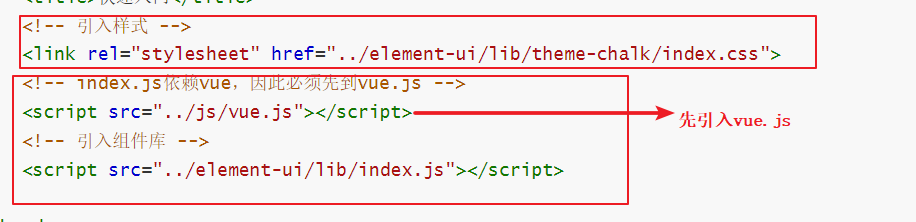

~~~html
<!DOCTYPE html>
<html lang="en">
<head>
    <meta charset="UTF-8">
    <meta name="viewport" content="width=device-width, initial-scale=1.0">
    <title>快速入门</title>
    <!-- 引入样式 -->
    <link rel="stylesheet" href="../element-ui/lib/theme-chalk/index.css">
    <!-- index.js依赖vue，因此必须先到vue.js -->
    
    <!-- 引入组件库 -->
    

</head>
<body>
    <!-- 视图 -->
    

        <!-- <button>登录</button> -->
        <el-row>
            <el-button>默认按钮</el-button>
            <el-button type="primary">主要按钮</el-button>
            <el-button type="success">成功按钮</el-button>
            <el-button type="info">信息按钮</el-button>
            <el-button type="warning">警告按钮</el-button>
            <el-button type="danger">危险按钮</el-button>
          </el-row>
          
          <el-row>
            <el-button plain>朴素按钮</el-button>
            <el-button type="primary" plain>主要按钮</el-button>
            <el-button type="success" plain>成功按钮</el-button>
            <el-button type="info" plain>信息按钮</el-button>
            <el-button type="warning" plain>警告按钮</el-button>
            <el-button type="danger" plain>危险按钮</el-button>
          </el-row>
          
          <el-row>
            <el-button round>圆角按钮</el-button>
            <el-button type="primary" round>主要按钮</el-button>
            <el-button type="success" round>成功按钮</el-button>
            <el-button type="info" round>信息按钮</el-button>
            <el-button type="warning" round>警告按钮</el-button>
            <el-button type="danger" round>危险按钮</el-button>
          </el-row>
          
          <el-row>
            <el-button icon="el-icon-search" circle></el-button>
            <el-button type="primary" icon="el-icon-edit" circle></el-button>
            <el-button type="success" icon="el-icon-check" circle></el-button>
            <el-button type="info" icon="el-icon-message" circle></el-button>
            <el-button type="warning" icon="el-icon-star-off" circle></el-button>
            <el-button type="danger" icon="el-icon-delete" circle></el-button>
          </el-row>
    

</body>

</html>
~~~

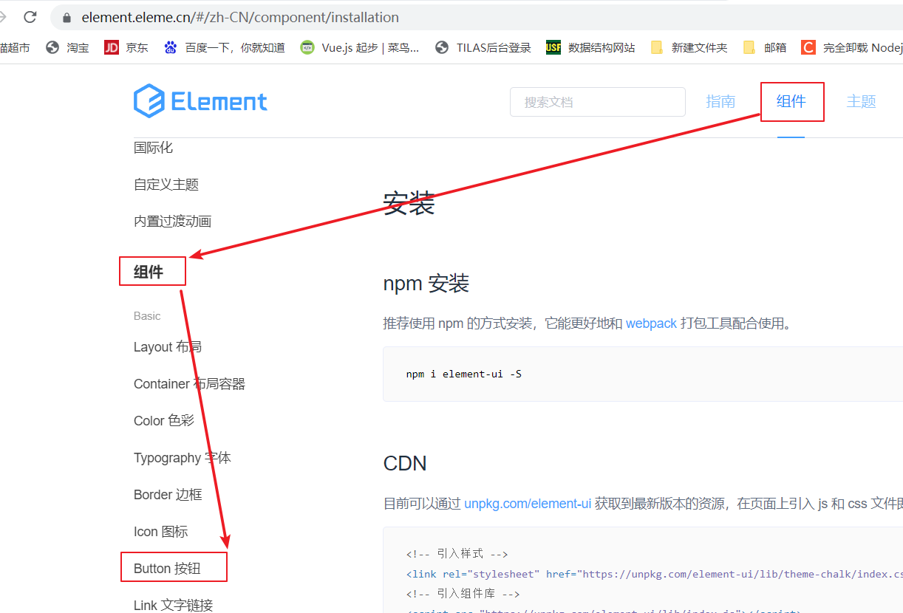

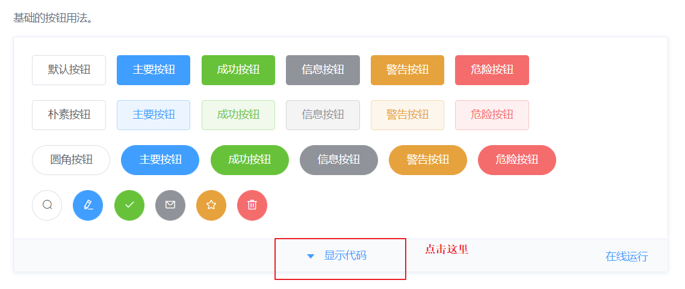

## 2.基础布局

~~~html
<!DOCTYPE html>
<html lang="en">
<head>
    <meta charset="UTF-8">
    <meta name="viewport" content="width=device-width, initial-scale=1.0">
    <title>基础布局</title>
    <link rel="stylesheet" href="../element-ui/lib/theme-chalk/index.css">
    
    
    
</head>
<body>
    

        <el-row>
            <!-- 一行最多24分栏 -->
            <!-- :span="24" 全称写法：v-bind:span="24"-->
            <el-col :span="24">

</el-col>
        </el-row>
        <el-row>
            <el-col :span="12">

</el-col>
            <el-col :span="12">

</el-col>
        </el-row>
        <el-row>
            <el-col :span="8">

</el-col>
            <el-col :span="8">

</el-col>
            <el-col :span="8">

</el-col>
        </el-row>
        <el-row>
            <el-col :span="6">

</el-col>
            <el-col :span="6">

</el-col>
            <el-col :span="6">

</el-col>
            <el-col :span="6">

</el-col>
        </el-row>
        <el-row>
            <el-col :span="4">

</el-col>
            <el-col :span="4">

</el-col>
            <el-col :span="4">

</el-col>
            <el-col :span="4">

</el-col>
            <el-col :span="4">

</el-col>
            <el-col :span="4">

</el-col>
        </el-row>

    

</body>

</html>
~~~

## 3.容器布局

~~~html
<!DOCTYPE html>
<html lang="en">
<head>
    <meta charset="UTF-8">
    <meta name="viewport" content="width=device-width, initial-scale=1.0">
    <title>容器布局</title>
    <link rel="stylesheet" href="../element-ui/lib/theme-chalk/index.css">
    
    
    
</head>
<body>
    

      <!-- TODO: el-container表示外层容器-->
      <el-container>
        <!-- TODO:el-header顶栏容器，下面会垂直显示 -->
        <el-header>Header</el-header>
        <el-container>
          <!-- TODO:el-aside表示侧边栏容器  -->
          <el-aside width="200px">Aside</el-aside>

          <el-container>
            <!-- TODO:el-main:表示主区域 -->
            <el-main>Main</el-main>
            <!-- TODO :el-footer 底栏容器-->
            <el-footer>Footer</el-footer>
          </el-container>
        </el-container>
      </el-container>
    

</body>

</html>
~~~

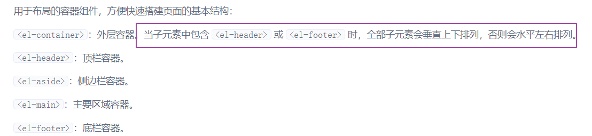

## 4.表单组件(掌握)

~~~html
<!DOCTYPE html>
<html lang="en">
<head>
    <meta charset="UTF-8">
    <meta name="viewport" content="width=device-width, initial-scale=1.0">
    <title>表单组件</title>
    <link rel="stylesheet" href="../element-ui/lib/theme-chalk/index.css">
    
    
</head>
<body>
    

        <!-- Form 组件提供了表单验证的功能，只需要通过 rules 属性传入约定的验证规则，并将 Form-Item 的 prop 属性设置为需校验的字段名即可 -->
        <!-- 
            1.el-form 标签表示form表单标签
            2.:rules="rules" 全称写法 v-bind:rules="rules"  属性值rules是数据模型中。
                    rules: {
                                name: [
                                    { required: true, message: '请输入活动名称', trigger: 'blur' },
                                    { min: 3, max: 5, message: '长度在 3 到 5 个字符', trigger: 'blur' }
                                ],
                                region: [
                                    { required: true, message: '请选择活动区域', trigger: 'change' }
                                ],
                                date1: [
                                    { type: 'date', required: true, message: '请选择日期', trigger: 'change' }
                                ],
                                date2: [
                                    { type: 'date', required: true, message: '请选择时间', trigger: 'change' }
                                ],
                                type: [
                                    { type: 'array', required: true, message: '请至少选择一个活动性质', trigger: 'change' }
                                ],
                                resource: [
                                    { required: true, message: '请选择活动资源', trigger: 'change' }
                                ],
                                desc: [
                                    { required: true, message: '请填写活动形式', trigger: 'blur' }
                                ]
                        }

         -->
        <el-form :model="ruleForm" :rules="rules" ref="ruleForm" label-width="100px" class="demo-ruleForm">
            <!-- 
                通过el-form-item属性prop="name"来设置需要校验的字段，prop的属性值name就是下面数据模型中rules的key:
                    rules: {
                                name: [
                                    { required: true, message: '请输入活动名称', trigger: 'blur' },
                                    { min: 3, max: 5, message: '长度在 3 到 5 个字符', trigger: 'blur' }
                                ]
                                ....
                            }
                
              label="活动名称" 就是输入框前面显示的内容
             -->
            <el-form-item label="用户名" prop="name">
                <!-- 
                    v-model="ruleForm.name" 双向数据绑定。视图改变。数据模型改变。数据模型改变，视图改变。
                    v-model="ruleForm.name"  数据模型中有ruleForm，并且在ruleForm中有name:
                        ruleForm: {
                            name: '',
                            region: '',
                            date1: '',
                            date2: '',
                            delivery: false,
                            type: [],
                            resource: '',
                            desc: ''
                    },
                 -->
              <el-input v-model="ruleForm.name"></el-input>
            </el-form-item>
            <el-form-item label="活动区域" prop="region">
              <el-select v-model="ruleForm.region" placeholder="请选择活动区域">
                <el-option label="区域一" value="shanghai"></el-option>
                <el-option label="区域二" value="beijing"></el-option>
              </el-select>
            </el-form-item>
            <el-form-item label="活动时间" required>
              <el-col :span="11">
                <el-form-item prop="date1">
                  <el-date-picker type="date" placeholder="选择日期" v-model="ruleForm.date1" style="width: 100%;"></el-date-picker>
                </el-form-item>
              </el-col>
              <el-col class="line" :span="2">-</el-col>
              <el-col :span="11">
                <el-form-item prop="date2">
                  <el-time-picker placeholder="选择时间" v-model="ruleForm.date2" style="width: 100%;"></el-time-picker>
                </el-form-item>
              </el-col>
            </el-form-item>
            <el-form-item label="即时配送" prop="delivery">
              <el-switch v-model="ruleForm.delivery"></el-switch>
            </el-form-item>
            <el-form-item label="活动性质" prop="type">
              <el-checkbox-group v-model="ruleForm.type">
                <el-checkbox label="美食/餐厅线上活动" name="type"></el-checkbox>
                <el-checkbox label="地推活动" name="type"></el-checkbox>
                <el-checkbox label="线下主题活动" name="type"></el-checkbox>
                <el-checkbox label="单纯品牌曝光" name="type"></el-checkbox>
              </el-checkbox-group>
            </el-form-item>
            <el-form-item label="特殊资源" prop="resource">
              <el-radio-group v-model="ruleForm.resource">
                <el-radio label="线上品牌商赞助"></el-radio>
                <el-radio label="线下场地免费"></el-radio>
              </el-radio-group>
            </el-form-item>
            <el-form-item label="活动形式" prop="desc">
              <el-input type="textarea" v-model="ruleForm.desc"></el-input>
            </el-form-item>
            <el-form-item>
                <!-- 
                    @click="submitForm('ruleForm')" : 给当前按钮标签绑定一个单击事件，单击 立即创建 按钮的时候就会调用submitForm函数
                    ruleForm代表整个form表单进行传递到该函数中
                 -->
              <el-button type="primary" @click="submitForm('ruleForm')">立即创建</el-button>
              <el-button @click="resetForm('ruleForm')">重置</el-button>
            </el-form-item>
          </el-form>
    

</body>

</html>
~~~

## 5.表格组件

~~~html
<!DOCTYPE html>
<html lang="en">
<head>
    <meta charset="UTF-8">
    <meta name="viewport" content="width=device-width, initial-scale=1.0">
    <title>表格组件</title>
    <link rel="stylesheet" href="../element-ui/lib/theme-chalk/index.css">
    
    
    
</head>
<body>
    

        <!-- 当el-table元素中注入data对象数组后，在el-table-column中用prop属性来对应对象中的键名即可填入数据，
            用label属性来定义表格的列名。可以使用width属性来定义列宽。 -->

        <!-- 
            1.:data="tableData" 通过data属性将数据模型的数据tableData注入到表格中：
                tableData: [{
                                    date: '2016-05-02',
                                    name: '王小虎',
                                    address: '上海市普陀区金沙江路 1518 弄'
                                }, {
                                    date: '2016-05-04',
                                    name: '王小虎',
                                    address: '上海市普陀区金沙江路 1517 弄'
                                }, {
                                    date: '2016-05-01',
                                    name: '王小虎',
                                    address: '上海市普陀区金沙江路 1519 弄'
                                }, {
                                    date: '2016-05-03',
                                    name: '王小虎',
                                    address: '上海市普陀区金沙江路 1516 弄'
                            }]
         -->
        <el-table
        :data="tableData"
        style="width: 100%"
        :row-class-name="tableRowClassName"
        >
        <!-- 
                2.在el-table-column中用prop属性来对应对象中的键名即可填入数据，
                3. 用label属性来定义表格的列名
        -->
        <el-table-column
          prop="date"
          label="日期"
          width="180">
        </el-table-column>
        <el-table-column
          prop="name"
          label="姓名"
          width="180">
        </el-table-column>
        <el-table-column
          prop="address"
          label="地址">
        </el-table-column>
      </el-table>
    

</body>

</html>
~~~

## 6.导航栏组件

~~~html
<!DOCTYPE html>
<html lang="en">
<head>
    <meta charset="UTF-8">
    <meta name="viewport" content="width=device-width, initial-scale=1.0">
    <title>顶部导航栏</title>
    <link rel="stylesheet" href="../element-ui/lib/theme-chalk/index.css">
    
    
</head>
<body>
    

        <!-- 
            1.导航菜单默认为垂直模式，通过mode属性可以使导航菜单变更为水平模式。
                mode="vertical" 垂直模式 
                mode="horizontal" 水平
            2.background-color：菜单的背景色
            3.text-color:菜单的文字颜色
            4.active-text-color:当前激活菜单的文字颜色 .就是你当前在菜单位置上显示的颜色
         -->
        <el-menu
                :default-active="activeIndex2"
                class="el-menu-demo"
                mode="horizontal"
                @select="handleSelect"
                background-color="#545c64"
                text-color="#fff"
                active-text-color="#ffd04b">
                <el-menu-item index="1">处理中心</el-menu-item>
                <!-- 5.另外，在菜单中通过submenu组件可以生成二级菜单 -->
                <el-submenu index="2">
                    <template slot="title">Java</template>
                    <el-menu-item index="2-1">javame</el-menu-item>
                    <el-menu-item index="2-2">javase</el-menu-item>
                    <!-- <el-menu-item index="2-3">c++</el-menu-item> -->
                    <el-submenu index="2-4">
                    <template slot="title">javaee</template>
                    <el-menu-item index="2-4-1">前端</el-menu-item>
                    <el-menu-item index="2-4-2">web</el-menu-item>
                    <el-menu-item index="2-4-3">框架</el-menu-item>
                    </el-submenu>
                </el-submenu>
                <!-- disabled 禁用 -->
                <el-menu-item index="3" disabled>消息中心</el-menu-item>
                <!-- _blank 在新的页面；_self 在当前页面打开 -->
                <el-menu-item index="4"><a href="https://www.ele.me" target="_self">订单管理</a></el-menu-item>
        </el-menu>
    

</body>

</html>
~~~

## 7.element综合案例

~~~html
<!DOCTYPE html>
<html lang="en">
<head>
    <meta charset="UTF-8">
    <meta name="viewport" content="width=device-width, initial-scale=1.0">
    <title>学生列表</title>
    <link rel="stylesheet" href="../element-ui/lib/theme-chalk/index.css">
    
    
    
</head>
<body>
  

    <el-container>
      <!-- 头部 -->
      <el-header class="el-header">
        <el-container>
          

            <!-- 图片 -->
            <el-image src="img/export.png" class="header-img"></el-image>
          

          <!-- el-menu 导航栏菜单 -->
          <el-menu
            :default-active="activeIndex2"
            mode="horizontal"
            @select="handleSelect"
            background-color="#545c64"
            text-color="white"
            active-text-color="#ffd04b"
            style="margin-left: auto;">
            <el-menu-item index="1">处理中心</el-menu-item>
            <!-- 二级菜单 -->
            <el-submenu index="2">
              <template slot="title">我的工作台</template>
              <el-menu-item index="2-1">选项1</el-menu-item>
              <el-menu-item index="2-2">选项2</el-menu-item>
              <el-menu-item index="2-3">选项3</el-menu-item>
            </el-submenu>
            <el-menu-item index="3"><a href="学生列表.html" target="_self">首页</a></el-menu-item>
          </el-menu>
        </el-container>
      </el-header>

      <el-container style="height: 580px; border: 1px solid #eee">
        <!-- 侧边栏区域 -->
        <el-aside width="200px" style="background-color: rgb(238, 241, 246)">
          <!-- 
              :default-openeds="['1']" 页面加载默认展开的菜单 1表示el-submenu index="1" 的index的值
           -->
          <el-menu :default-openeds="['1']">
            <el-submenu index="1">
              <template slot="title"><i class="el-icon-menu"></i>学工部</template>
              <el-menu-item-group>
                <el-menu-item index="1-1"><i class="el-icon-help"></i>在校学生管理</el-menu-item>
                <el-menu-item index="1-2"><i class="el-icon-help"></i>学生升级/留级</el-menu-item>
                <el-menu-item index="1-3"><i class="el-icon-help"></i>学生就业情况</el-menu-item>
              </el-menu-item-group>
            </el-submenu>
            <el-submenu index="2">
              <template slot="title"><i class="el-icon-menu"></i>咨询部</template>
              <el-menu-item-group>
                <el-menu-item index="2-1"><i class="el-icon-help"></i>意向学生管理</el-menu-item>
                <el-menu-item index="2-2"><i class="el-icon-help"></i>未报名学生管理</el-menu-item>
                <el-menu-item index="2-3"><i class="el-icon-help"></i>已报名学生管理</el-menu-item>
              </el-menu-item-group>
            </el-submenu>
            <el-submenu index="3">
              <template slot="title"><i class="el-icon-menu"></i>教研部</template>
              <el-menu-item-group>
                <el-menu-item index="3-1"><i class="el-icon-help"></i>已有课程管理</el-menu-item>
                <el-menu-item index="3-2"><i class="el-icon-help"></i>正在研发课程管理</el-menu-item>
                <el-menu-item index="3-3"><i class="el-icon-help"></i>新技术课程管理</el-menu-item>
              </el-menu-item-group>
            </el-submenu>
          </el-menu>
        </el-aside>
        
        <!-- 主区域 -->
        <el-container>
          <el-main>
            <b style="color: red;font-size: 20px;">学生列表</b>
            

              <el-button type="primary">添加学生</el-button>
            

            <!-- 
              el-table :表格。通过属性:data="tableData" 向表格中注入数据
             -->
            <el-table :data="tableData"  style="width: 100%;"
            >
            <!-- label="日期"  表示列名 -->
              <el-table-column prop="date" label="日期" >
              </el-table-column>
              <el-table-column prop="name" label="姓名" >
              </el-table-column>
              <el-table-column prop="address" label="地址" >
              </el-table-column>
              <el-table-column prop="age" label="年龄" >
              </el-table-column>
              <el-table-column
                label="操作"
                width="180">
                <el-button type="warning">编辑</el-button>
                <el-button type="danger">删除</el-button>
              </el-table-column>
            </el-table>
          </el-main>
        </el-container>
      </el-container>
    </el-container>
  

</body>

</html>
~~~

# 3.node.js使用

1.如果在vscode中使用node命令运行js文件报错：基本都是权限问题导致的。需要将vscode软件设置为管理员启动即可。

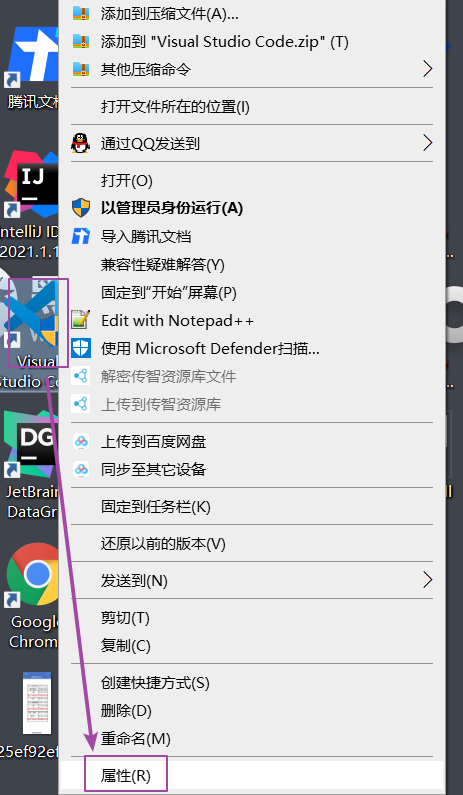

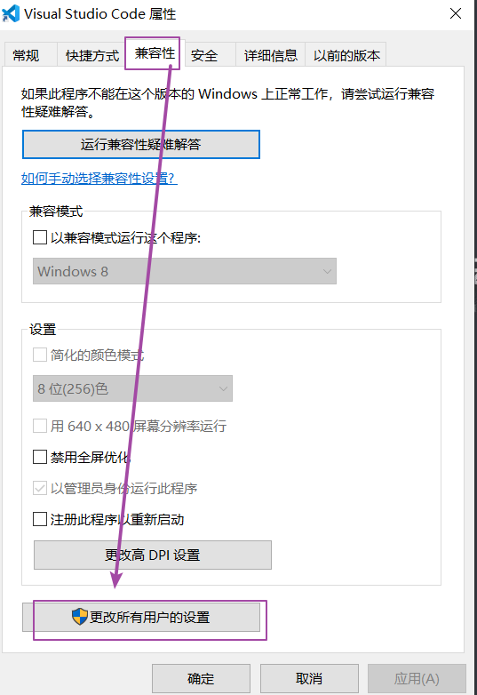

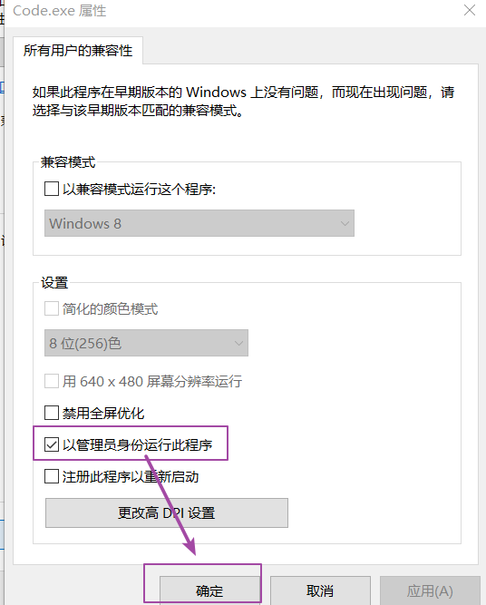

# 4.nodejs的包管理器npm

## 1)使用npm进行初始化

~~~java
npm init
~~~

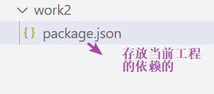

## 2)使用npm在本地即当前模块下安装软件

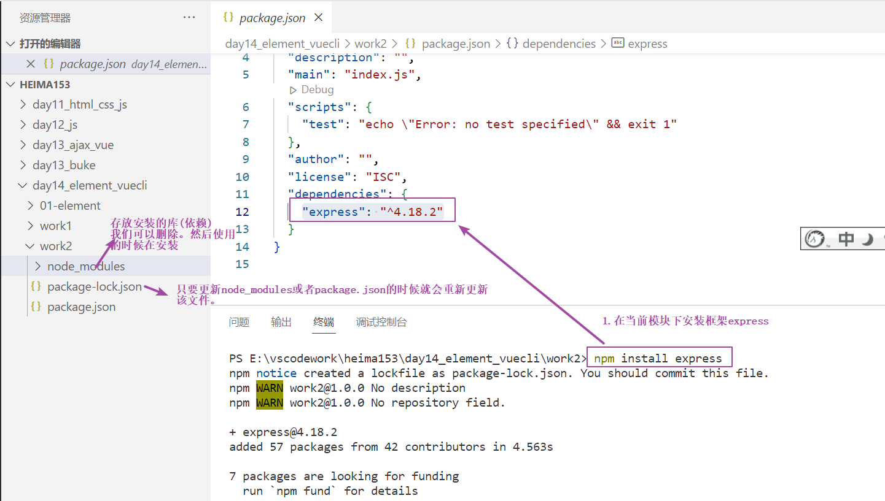

~~~java
npm install 安装的技术
~~~

## 3）全局安装(掌握)

【1】查看你的电脑存放依赖的全局位置

~~~java
npm root -g  
~~~

【2】向全局位置安装依赖

~~~java
npm install 安装的技术 -g  =====》g：global全局的意思
举例：向全局位置安装vue
npm install vue -g 
~~~

## 4)淘宝NPM镜像【建议使用】

npm下载的资源都来自于国外，下载资源慢。因此我们以后可以使用国内的技术淘宝NPM镜像即cnpm.想用淘宝镜像需要先下载淘宝镜像。

【1】下载步骤：

1.更换成淘宝的源

~~~

npm config set registry https://registry.npm.taobao.org 
~~~

2.降低版本

~~~java
npm install cnpm@7.1.0 -g
~~~

【2】验证是否安装成功：

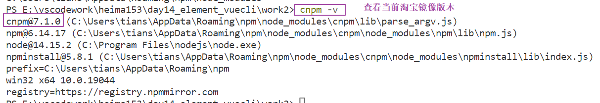

【3】使用cnpm安装软件：

~~~java
cnpm install -g axios
~~~

【4】使用npm下载淘宝镜像报错问题:

参考：

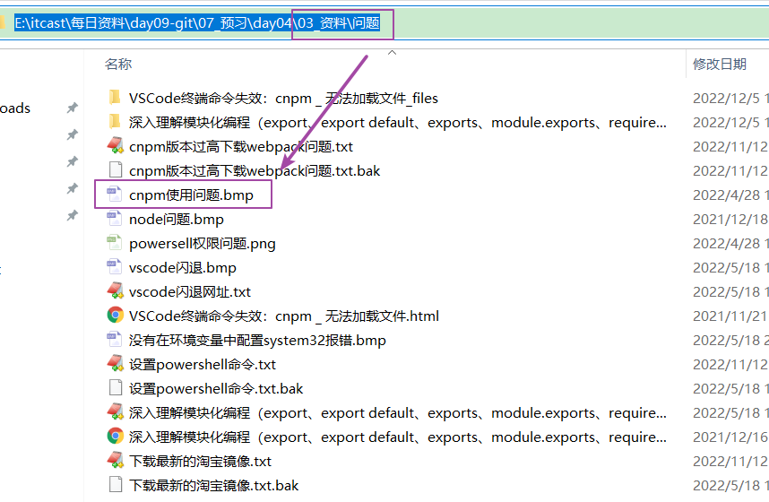

# 5.webpack（掌握）

## 1.作用

**将前端的文件进行打包**。我们可以将打包后的文件发布到前端服务器上

## 2.webpack打包应用

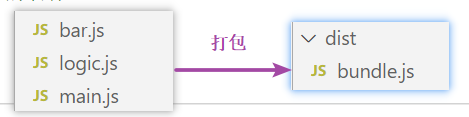

webpack.config.js

~~~javascript
var path = require("path"); // 导入 node.js 中专门操作路径的模块，固定写法
//执行webpack命令的时候会读取到module.exports中的内容
module.exports = {
    //执行webpack命令的时候,读取入口main.js，由于main.js关联bar.js和logic.js，
	//所以会将这三个js文件合并到一个js文件中
	entry: './src/main.js', // 打包入口文件的路径
    //输出文件位置
	output: {
        //__dirname表示当前工程目录
		path: path.resolve(__dirname, './dist'),  // 输出文件的存放路径
		filename: 'bundle.js'  // 输出文件的名称
	}
};
~~~

## 3.基于npm方式打包

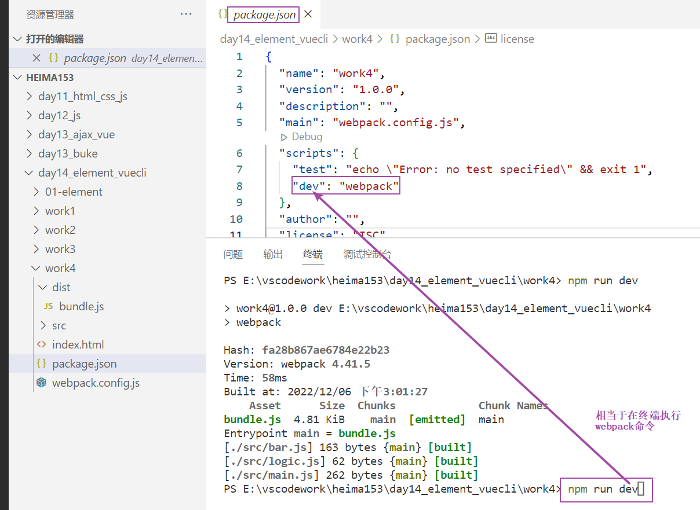

记住命令：

~~~java
npm run dev 启动项目
    
~~~

## 4.webpack-dev-server 开发服务器

【1】作用：当更改打包的源码的js文件时会自动更新====>资源热更新。

# 6.小结

vue脚手架之前安装的软件:

1.安装node.js

2.安装淘宝镜像 cnpm

3.安装打包器：webpack  

# 7.vue-cli脚手架(掌握)

## 1.学习脚手架掌握重点

【1】常见命令

~~~markdown
#1.启动项目 
npm run dev
#2.安装当前项目所有的依赖
cnpm i
~~~

【2】熟悉脚手架的常见目录

## 2.vue脚手架入门

### 1.安装脚手架到全局位置

~~~java
cnpm install vue-cli -g 
~~~

### 2.使用脚手架命令初始化工程(开发中都是前端工程师做的)

~~~java
cnpm install vue-cli -g    # 只需安装一次， 可以使用cnpm安装,通过

# Windows使用 `vue init` 的运行效果将会跟 `vue-cli@2.x` 相同
# work5是模块名字
vue init webpack work5
~~~

## 3.vue-cli脚手架常见的目录结构

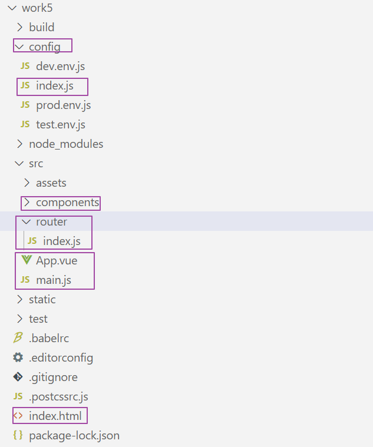

~~~markdown
#1.main.js :表示入口文件
#2.App.vue :表示根组件，在脚手架中只要以.vue结尾的都是组件
	<template>
  		书写html标签的，只能书写一个根标签
  		

  		
  		

	</template>

    

    
    例如：
    	<template>
              

                <!-- 脚手架的logo图片 -->
                <!--  -->
                <!-- 组件输出位置，欢迎页面输出的文字是由下面的标签输出的 -->
                <!-- <router-view/> -->
                <h1>{{msg}}</h1>
              

            </template>

            

            

    
#3.index.html后期不会修改
~~~

## 4.路由

【1】概念：在vue脚手架中路由表示浏览器地址栏输入的路径和组件的映射关系。

## 5.脚手架小结

【1】

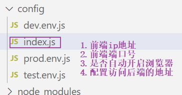

【2】

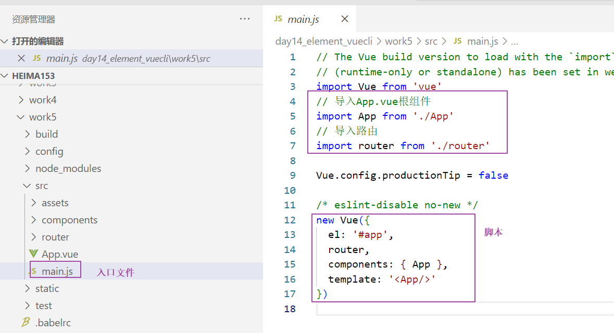

【3】

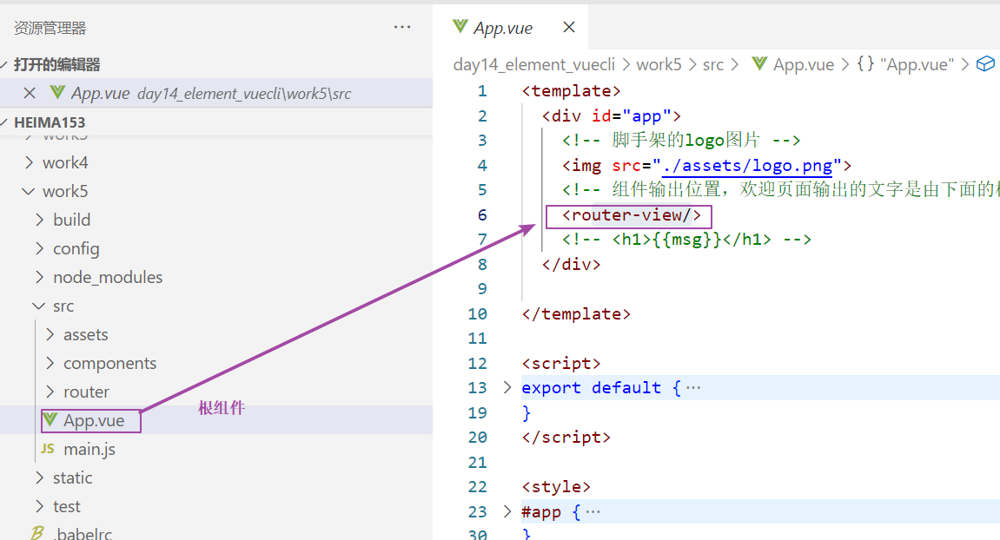

【4】

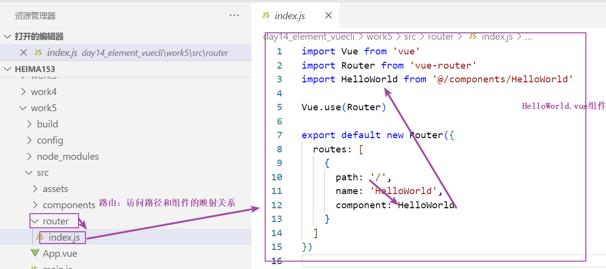

注意：前端工程师会在src下面创建一个文件夹:views。存放自己创建的组件即以.vue结尾

# 8.vue-cli脚手架练习 作业

## 1.模拟网易云音乐

【1】在根组件App.vue添加超链接

~~~vue
<template>
  

    <!-- 脚手架的logo图片 -->
    
    <!-- 访问vue ,必须加#-->
    <a href="#/">访问vue</a>
    <a href="#/friend">访问好友</a>
    <!-- 组件输出位置，欢迎页面输出的文字是由下面的标签输出的 -->
    <router-view/>
    <!-- <h1>{{msg}}</h1> -->
  

</template>

~~~

【2】在路由中配置访问的路径和组件的关系

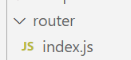

~~~javascript
import Vue from 'vue'
import Router from 'vue-router'
import HelloWorld from '@/components/HelloWorld'
// @表示src目录 ==>src/views/friend.vue
//http://localhost:8080/#/friend===> path: '/friend'===> component: friend===>import friend from===>src/views/friend.vue
import friend from '@/views/friend'

Vue.use(Router)

export default new Router({
  routes: [
    {
      path: '/',
      name: 'HelloWorld',
      component: HelloWorld
    },
    {
      path: '/friend',
      name: 'haha',
      component: friend
    }
  ]
})

~~~

【3】创建组件

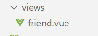

~~~vue
<template>
    

        {{username}}
    

</template>

~~~

## 2.将Element-UI组件库添加到vue脚手架中

### 【1】安装

1.在当前工程下安装element

~~~java
cnpm i element-ui -S
~~~

2.在main.js文件中引入element内容

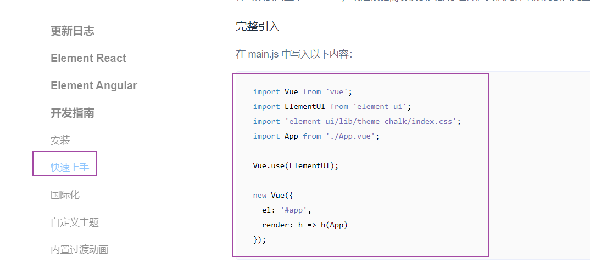

~~~java
// The Vue build version to load with the `import` command
// (runtime-only or standalone) has been set in webpack.base.conf with an alias.
import Vue from 'vue'
//导入element
import ElementUI from 'element-ui';
// 导入element的css样式
import 'element-ui/lib/theme-chalk/index.css';
// 导入App.vue根组件
import App from './App'
// 导入路由
import router from './router'
// 让vue对象使用ElementUI
Vue.use(ElementUI);
Vue.config.productionTip = false

/* eslint-disable no-new */
new Vue({
  el: '#app',
  router,
  components: { App },
  template: '<App/>'
})

~~~

### 【2】代码实现

#### 1.在App.vue根组件中书写超链接

~~~vue
<template>
  

    <!-- 脚手架的logo图片 -->
    
    <!-- 访问vue ,必须加#-->
    <a href="#/">访问vue</a>
    <a href="#/friend">访问好友</a>
    <a href="#/element">访问element</a>
    <!-- 组件输出位置，欢迎页面输出的文字是由下面的标签输出的 -->
    <router-view/>
    <!-- <h1>{{msg}}</h1> -->
  

</template>

~~~

#### 2.在路由中配置路径和组件的关系

~~~javascript
import Vue from 'vue'
import Router from 'vue-router'
import HelloWorld from '@/components/HelloWorld'
// @表示src目录 ==>src/views/friend.vue
import friend from '@/views/friend'
import element from '@/views/element'

Vue.use(Router)

export default new Router({
  routes: [
    {
      path: '/',
      name: 'HelloWorld',
      component: HelloWorld
    },
    {
      path: '/friend',
      name: 'haha',
      component: friend
    },
    {
      path: '/element',
      name: 'element',
      component: element
    }
  ]
})

~~~

#### 3.创建组件

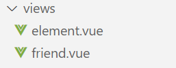

~~~vue
 <template>
    <el-table
      :data="tableData"
      style="width: 100%">
      <el-table-column
        prop="date"
        label="日期"
        width="180">
      </el-table-column>
      <el-table-column
        prop="name"
        label="姓名"
        width="180">
      </el-table-column>
      <el-table-column
        prop="address"
        label="地址">
      </el-table-column>
    </el-table>
  </template>

  

~~~

# 今日反馈和作业

1.Element：

> 1)快速搭建网站的技术，基于css+vue
>
> 2）使用的时候到官网借鉴
>
> https://element.eleme.cn/#/zh-CN/component/installation
>
> 3）重点掌握表单

2.脚手架:

> 1.安装软件：
>
> ​    1）node.js ： 基于谷歌浏览器，解析js文件
>
> ​	2）安装cnpm即淘宝镜像：替换npm下载功能，下载软件快
>
> ​	3）安装 webpack
>
> ​	4）安装脚手架
>
> 2.一定要会的两个命令:
>
> ​	1)安装依赖：cnpm i  安装依赖
>
> 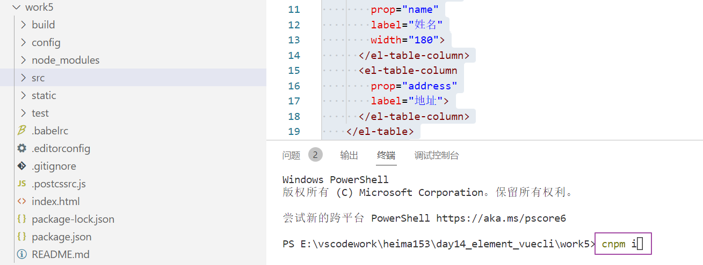
>
> ​	2)启动项目 ： npm run dev
>
> 3.熟悉脚手架常见目录：
>
> ​	1）App.vue 根组件
>
> ​	2）main.js 入口文件
>
> ​	3）router/index.js 路由，配置路径和组件的关系
>
> ​	4）config/index.js 配置前端ip 端口号 是否自动打开浏览器 后端的地址
>
> ​	5）自定义的组件放到views文件夹下

3.作业：

> 1.模拟网易云
>
> 2.安装element
