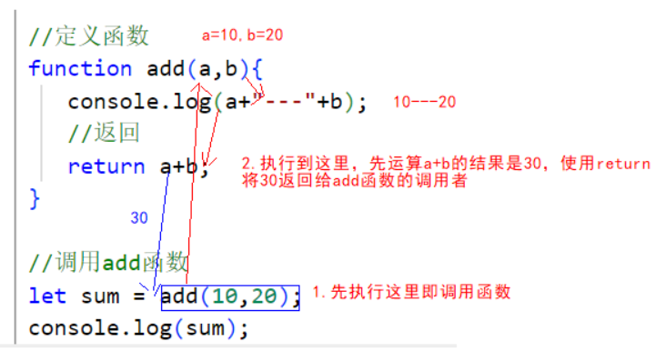
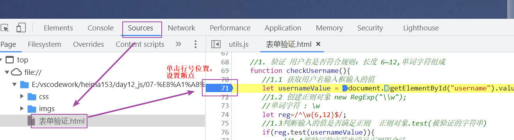
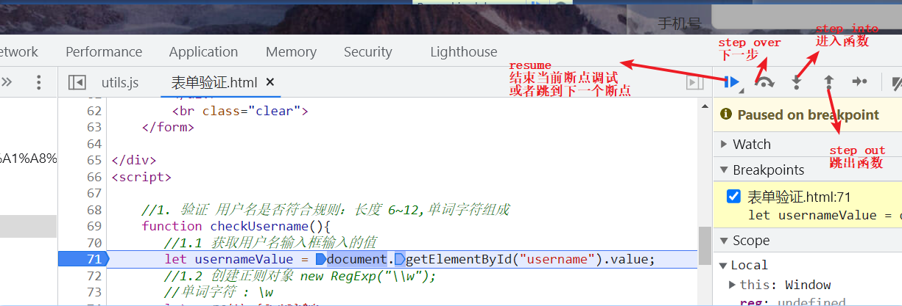

# 随堂笔记

# 1.今日目标和应用

~~~javascript
1.JavaScript 校验页面
2.JavaScript 完成轮播图 弹出广告 等
~~~

# 2.函数(掌握)

## 1.函数格式一

~~~html
<!-- 文档类型声明标签，告知浏览器这个页面采取html版本来显示页面 -->
<!DOCTYPE html>
<!-- 告诉浏览器这是一个英文网站，本页面采取英文显示，单也可以书写中文 -->
<html lang="en">

<head>
    <!-- 必须书写，告知浏览器以UTF-8编码表编解码中文，如果不书写就会乱码 -->
    <meta charset="UTF-8">
    <meta http-equiv="X-UA-Compatible" content="IE=edge">
    <meta name="viewport" content="width=device-width, initial-scale=1.0">
    <!-- 标题标签 -->
    <title>title</title>
</head>
<body>
  
</body>
</html>
~~~

1.小结：

 

2.格式一：

~~~html
function 函数名(参数名,参数名,..){
	函数体
}
~~~

3.函数必须被调用才能执行

~~~html
let 变量名 = 函数名(实参,实参);
~~~

## 2.函数格式二

~~~html
<!-- 文档类型声明标签，告知浏览器这个页面采取html版本来显示页面 -->
<!DOCTYPE html>
<!-- 告诉浏览器这是一个英文网站，本页面采取英文显示，单也可以书写中文 -->
<html lang="en">

<head>
    <!-- 必须书写，告知浏览器以UTF-8编码表编解码中文，如果不书写就会乱码 -->
    <meta charset="UTF-8">
    <meta http-equiv="X-UA-Compatible" content="IE=edge">
    <meta name="viewport" content="width=device-width, initial-scale=1.0">
    <!-- 标题标签 -->
    <title>title</title>
</head>
<body>
  
</body>
</html>
~~~

## 3.函数注意事项

~~~html
<!-- 文档类型声明标签，告知浏览器这个页面采取html版本来显示页面 -->
<!DOCTYPE html>
<!-- 告诉浏览器这是一个英文网站，本页面采取英文显示，单也可以书写中文 -->
<html lang="en">

<head>
    <!-- 必须书写，告知浏览器以UTF-8编码表编解码中文，如果不书写就会乱码 -->
    <meta charset="UTF-8">
    <meta http-equiv="X-UA-Compatible" content="IE=edge">
    <meta name="viewport" content="width=device-width, initial-scale=1.0">
    <!-- 标题标签 -->
    <title>title</title>
</head>
<body>

</body>
</html>
~~~

# 3.对象(掌握)

## 1.数组对象Array

### 1.第一种定义格式

~~~html
<!-- 文档类型声明标签，告知浏览器这个页面采取html版本来显示页面 -->
<!DOCTYPE html>
<!-- 告诉浏览器这是一个英文网站，本页面采取英文显示，单也可以书写中文 -->
<html lang="en">

<head>
    <!-- 必须书写，告知浏览器以UTF-8编码表编解码中文，如果不书写就会乱码 -->
    <meta charset="UTF-8">
    <meta http-equiv="X-UA-Compatible" content="IE=edge">
    <meta name="viewport" content="width=device-width, initial-scale=1.0">
    <!-- 标题标签 -->
    <title>Title</title>
</head>
<body>

</body>
</html>
~~~

### 2.第二种定义格式

~~~html
<!-- 文档类型声明标签，告知浏览器这个页面采取html版本来显示页面 -->
<!DOCTYPE html>
<!-- 告诉浏览器这是一个英文网站，本页面采取英文显示，单也可以书写中文 -->
<html lang="en">

<head>
    <!-- 必须书写，告知浏览器以UTF-8编码表编解码中文，如果不书写就会乱码 -->
    <meta charset="UTF-8">
    <meta http-equiv="X-UA-Compatible" content="IE=edge">
    <meta name="viewport" content="width=device-width, initial-scale=1.0">
    <!-- 标题标签 -->
    <title>Title</title>
</head>
<body>

</body>
</html>
~~~

### 3.常见属性和函数

~~~html
<!-- 文档类型声明标签，告知浏览器这个页面采取html版本来显示页面 -->
<!DOCTYPE html>
<!-- 告诉浏览器这是一个英文网站，本页面采取英文显示，单也可以书写中文 -->
<html lang="en">

<head>
    <!-- 必须书写，告知浏览器以UTF-8编码表编解码中文，如果不书写就会乱码 -->
    <meta charset="UTF-8">
    <meta http-equiv="X-UA-Compatible" content="IE=edge">
    <meta name="viewport" content="width=device-width, initial-scale=1.0">
    <!-- 标题标签 -->
    <title>Title</title>
</head>
<body>

</body>
</html>
~~~

## 2.正则对象RegExp

~~~html
<!-- 文档类型声明标签，告知浏览器这个页面采取html版本来显示页面 -->
<!DOCTYPE html>
<!-- 告诉浏览器这是一个英文网站，本页面采取英文显示，单也可以书写中文 -->
<html lang="en">

<head>
    <!-- 必须书写，告知浏览器以UTF-8编码表编解码中文，如果不书写就会乱码 -->
    <meta charset="UTF-8">
    <meta http-equiv="X-UA-Compatible" content="IE=edge">
    <meta name="viewport" content="width=device-width, initial-scale=1.0">
    <!-- 标题标签 -->
    <title>Title</title>
</head>
<body>

</body>
</html>
~~~

## 3.String对象

~~~html
<!-- 文档类型声明标签，告知浏览器这个页面采取html版本来显示页面 -->
<!DOCTYPE html>
<!-- 告诉浏览器这是一个英文网站，本页面采取英文显示，单也可以书写中文 -->
<html lang="en">

<head>
    <!-- 必须书写，告知浏览器以UTF-8编码表编解码中文，如果不书写就会乱码 -->
    <meta charset="UTF-8">
    <meta http-equiv="X-UA-Compatible" content="IE=edge">
    <meta name="viewport" content="width=device-width, initial-scale=1.0">
    <!-- 标题标签 -->
    <title>Title</title>
</head>
<body>

</body>
</html>
~~~

**注意：求字符串长度是属性length不是函数length()。**

## 4.自定义对象(很重要)

~~~html
<!-- 文档类型声明标签，告知浏览器这个页面采取html版本来显示页面 -->
<!DOCTYPE html>
<!-- 告诉浏览器这是一个英文网站，本页面采取英文显示，单也可以书写中文 -->
<html lang="en">

<head>
    <!-- 必须书写，告知浏览器以UTF-8编码表编解码中文，如果不书写就会乱码 -->
    <meta charset="UTF-8">
    <meta http-equiv="X-UA-Compatible" content="IE=edge">
    <meta name="viewport" content="width=device-width, initial-scale=1.0">
    <!-- 标题标签 -->
    <title>Title</title>
</head>
<body>

</body>
</html>
~~~

# 4.BOM对象（掌握）

## 1.window对象

~~~html
<!-- 文档类型声明标签，告知浏览器这个页面采取html版本来显示页面 -->
<!DOCTYPE html>
<!-- 告诉浏览器这是一个英文网站，本页面采取英文显示，单也可以书写中文 -->
<html lang="en">

<head>
    <!-- 必须书写，告知浏览器以UTF-8编码表编解码中文，如果不书写就会乱码 -->
    <meta charset="UTF-8">
    <meta http-equiv="X-UA-Compatible" content="IE=edge">
    <meta name="viewport" content="width=device-width, initial-scale=1.0">
    <!-- 标题标签 -->
    <title>Title</title>
</head>
<body>
  
</body>
</html>
~~~

## 2.window对象练习_切换灯泡图片

~~~html
<!-- 文档类型声明标签，告知浏览器这个页面采取html版本来显示页面 -->
<!DOCTYPE html>
<!-- 告诉浏览器这是一个英文网站，本页面采取英文显示，单也可以书写中文 -->
<html lang="en">

<head>
    <!-- 必须书写，告知浏览器以UTF-8编码表编解码中文，如果不书写就会乱码 -->
    <meta charset="UTF-8">
    <meta http-equiv="X-UA-Compatible" content="IE=edge">
    <meta name="viewport" content="width=device-width, initial-scale=1.0">
    <!-- 标题标签 -->
    <title>Title</title>
</head>
<body>
<!--
    onclick属于js中的单击事件，只要单击当前开灯的input按钮标签就会执行该事件，调用该事件的js函数on()
-->
<input type="button" onclick="on()" value="开灯">
<!-- 引入灯泡的图片 -->

<input type="button" onclick="off()" value="关灯">

</body>
</html>
~~~

## 3.history(了解)

表示浏览器访问的历史记录

~~~html
<!-- 文档类型声明标签，告知浏览器这个页面采取html版本来显示页面 -->
<!DOCTYPE html>
<!-- 告诉浏览器这是一个英文网站，本页面采取英文显示，单也可以书写中文 -->
<html lang="en">

<head>
    <!-- 必须书写，告知浏览器以UTF-8编码表编解码中文，如果不书写就会乱码 -->
    <meta charset="UTF-8">
    <meta http-equiv="X-UA-Compatible" content="IE=edge">
    <meta name="viewport" content="width=device-width, initial-scale=1.0">
    <!-- 标题标签 -->
    <title>Title</title>
</head>
<body>
  <a href="demo03.html">跳转到demo03.html页面</a>
  <!-- 点击下面的按钮执行js的fn函数 -->
  <button onclick="fn()">-></button>
  
</body>
</html>

~~~

~~~html
<!-- 文档类型声明标签，告知浏览器这个页面采取html版本来显示页面 -->
<!DOCTYPE html>
<!-- 告诉浏览器这是一个英文网站，本页面采取英文显示，单也可以书写中文 -->
<html lang="en">

<head>
    <!-- 必须书写，告知浏览器以UTF-8编码表编解码中文，如果不书写就会乱码 -->
    <meta charset="UTF-8">
    <meta http-equiv="X-UA-Compatible" content="IE=edge">
    <meta name="viewport" content="width=device-width, initial-scale=1.0">
    <!-- 标题标签 -->
    <title>Title</title>
</head>
<body>
  <button onclick="fn1()"><-</button>
  
</body>
</html>
~~~

## 4.location(掌握)

~~~html
<!-- 文档类型声明标签，告知浏览器这个页面采取html版本来显示页面 -->
<!DOCTYPE html>
<!-- 告诉浏览器这是一个英文网站，本页面采取英文显示，单也可以书写中文 -->
<html lang="en">

<head>
    <!-- 必须书写，告知浏览器以UTF-8编码表编解码中文，如果不书写就会乱码 -->
    <meta charset="UTF-8">
    <meta http-equiv="X-UA-Compatible" content="IE=edge">
    <meta name="viewport" content="width=device-width, initial-scale=1.0">
    <!-- 标题标签 -->
    <title>Title</title>
</head>
<body>
  
</body>
</html>
~~~

# 5.DOM(掌握)

## 1.介绍

1.DOM:文档对象模型，操作html标签的文本 属性 css样式 以及事件的。

2.DOM中将所有的标签封装成对象 img标签  ===>Image 对象

3.所有标签的父对象是Element。

## 2.获取元素的方法

~~~html
<!-- 文档类型声明标签，告知浏览器这个页面采取html版本来显示页面 -->
<!DOCTYPE html>
<!-- 告诉浏览器这是一个英文网站，本页面采取英文显示，单也可以书写中文 -->
<html lang="en">

<head>
    <!-- 必须书写，告知浏览器以UTF-8编码表编解码中文，如果不书写就会乱码 -->
    <meta charset="UTF-8">
    <meta http-equiv="X-UA-Compatible" content="IE=edge">
    <meta name="viewport" content="width=device-width, initial-scale=1.0">
    <!-- 标题标签 -->
    <title>Title</title>
</head>
<body>
  

传智教育
    

黑马程序员
  

<input type="checkbox" name="hobby"> 电影
<input type="checkbox" name="hobby"> 旅游
<input type="checkbox" name="hobby"> 游戏
 

</body>
</html>
~~~

## 3.元素的使用

~~~html
<!-- 文档类型声明标签，告知浏览器这个页面采取html版本来显示页面 -->
<!DOCTYPE html>
<!-- 告诉浏览器这是一个英文网站，本页面采取英文显示，单也可以书写中文 -->
<html lang="en">

<head>
    <!-- 必须书写，告知浏览器以UTF-8编码表编解码中文，如果不书写就会乱码 -->
    <meta charset="UTF-8">
    <meta http-equiv="X-UA-Compatible" content="IE=edge">
    <meta name="viewport" content="width=device-width, initial-scale=1.0">
    <!-- 标题标签 -->
    <title>Title</title>
</head>
<body>
  

传智教育

 

黑马程序员

 

<input type="checkbox" name="hobby"> 电影
<input type="checkbox" name="hobby"> 旅游
<input type="checkbox" name="hobby"> 游戏
 

</body>
</html>
~~~

## 4.事件绑定介绍

~~~html
<!-- 文档类型声明标签，告知浏览器这个页面采取html版本来显示页面 -->
<!DOCTYPE html>
<!-- 告诉浏览器这是一个英文网站，本页面采取英文显示，单也可以书写中文 -->
<html lang="en">

<head>
    <!-- 必须书写，告知浏览器以UTF-8编码表编解码中文，如果不书写就会乱码 -->
    <meta charset="UTF-8">
    <meta http-equiv="X-UA-Compatible" content="IE=edge">
    <meta name="viewport" content="width=device-width, initial-scale=1.0">
    <!-- 标题标签 -->
    <title>Title</title>
</head>
<body>
<!-- 给下面的标签绑定单击事件,只要单击下面的按钮就会执行fn函数 -->
<input type="button"  value="点我试试" onclick="fn();"/>

<input type="button" value="点我试试" id="btn" class="cls"/>

</body>
</html>
~~~

## 5.常见事件

~~~html
<!-- 文档类型声明标签，告知浏览器这个页面采取html版本来显示页面 -->
<!DOCTYPE html>
<!-- 告诉浏览器这是一个英文网站，本页面采取英文显示，单也可以书写中文 -->
<html lang="en">

<head>
    <!-- 必须书写，告知浏览器以UTF-8编码表编解码中文，如果不书写就会乱码 -->
    <meta charset="UTF-8">
    <meta http-equiv="X-UA-Compatible" content="IE=edge">
    <meta name="viewport" content="width=device-width, initial-scale=1.0">
    <!-- 标题标签 -->
    <title>Title</title>
</head>
<body>

<form id="register" action="#">
    <input type="text" name="username" id="username"/>

    <input type="submit" value="提交">
</form>

</body>
</html>
~~~

1.表单提交事件，onsubmit。对于该事件，如果阻止表单提交，绑定的匿名函数体返回false.可以提交表单返回true.

onload事件

~~~html
<!-- 文档类型声明标签，告知浏览器这个页面采取html版本来显示页面 -->
<!DOCTYPE html>
<!-- 告诉浏览器这是一个英文网站，本页面采取英文显示，单也可以书写中文 -->
<html lang="en">

<head>
    <!-- 必须书写，告知浏览器以UTF-8编码表编解码中文，如果不书写就会乱码 -->
    <meta charset="UTF-8">
    <meta http-equiv="X-UA-Compatible" content="IE=edge">
    <meta name="viewport" content="width=device-width, initial-scale=1.0">
    <!-- 标题标签 -->
    <title>Title</title>
    
</head>
<body>

<form id="register" action="#">
    <input type="text" name="username" id="username"/>

    <input type="submit" value="提交">
</form>

</body>
</html>
~~~

# 6.js综合案例_校验表单(课下必须完成)

~~~html
<!-- 文档类型声明标签，告知浏览器这个页面采取html版本来显示页面 -->
<!DOCTYPE html>
<!-- 告诉浏览器这是一个英文网站，本页面采取英文显示，单也可以书写中文 -->
<html lang="en">

<head>
    <!-- 必须书写，告知浏览器以UTF-8编码表编解码中文，如果不书写就会乱码 -->
    <meta charset="UTF-8">
    <meta http-equiv="X-UA-Compatible" content="IE=edge">
    <meta name="viewport" content="width=device-width, initial-scale=1.0">
    <!-- 标题标签 -->
    <title>欢迎注册</title>
    <link href="css/register.css" rel="stylesheet">
</head>
<body>

    

        <h1>欢迎注册</h1>
        已有帐号？ <a href="#">登录</a>
    

    <form id="reg-form" action="#" method="get">

        <table>

            <tr>
                <td>用户名</td>
                <td class="inputs">
<!--                    <input name="username" type="text" id="username" onblur="checkUsername()">-->
                    <!-- TODO:给下面的用户名输入框绑定一个离焦事件，鼠标离开输入框焦点就调用函数checkUsername() -->
                    <input name="username" type="text" id="username" onblur="checkUsername()">
                     
                    <!--display: none 属于css语法，表示隐藏标签  -->
                    用户名不太受欢迎
                </td>

            </tr>

            <tr>
                <td>密码</td>
                <td class="inputs">
                    <input name="password" type="password" id="password" onblur="checkPassword()">
                     
                    密码格式有误
                </td>
            </tr>

            <tr>
                <td>手机号</td>
                <td class="inputs"><input name="tel" type="text" id="tel" onblur="checkTel()">
                     
                    手机号格式有误
                </td>
            </tr>

        </table>

        

            <input value="注 册" type="submit" id="reg_btn">
        

         
    </form>

</body>
</html>
~~~

# 7.浏览器debug(掌握)

1.使用浏览器打开页面然后按f12

2.设置断点

3.常见按钮

# 8.今日反馈和作业

~~~markdown
能够在JavaScript中定义函数
	1.function 函数名(参数名,参数名,..){
		return;
	}
	2.let 变量名 = function(){}
	3.标签对象.事件名 = function(){}
能够使用JavaScript提供的Array对象、String对象
	1.Array数组对象
		1）创建数组 let 数组名= new Array(数值,数值,....); 只有一个number值，表示数组长度 不能是小数
				   let 数组名=[数值,数值,...];
		2)数组长度可变   存储的数值类型不统一 
		3）push() 向数组末尾添加元素  
		4)splice(删除数据的索引，删除数据的个数)
	2.String：
		1）创建对象  let 对象名 =""或者''
		2）获取字符串的长度：字符串对象.length 
能够使用JavaScript自定义对象
	let 对象名={
		属性名:属性值,
		属性名:属性值,
		....
		函数名:function(参数名,...){
			//在函数中使用属性：this.属性名   this.get函数名()
		}
	}
	
	对象名.属性名 获取属性值
	对象名.函数名(实参);
能够使用Window对象弹出警告框、确认提示框
	1.警告框 ：window.alert(弹出信息);
	2.确认提示框：let result = window.confirm(提示信息); 点击确定按钮，返回值是true,点击取消返回false

能够使用Window对象设置定时器
	1.一直执行的定时器：
		let 变量名 = window.setInterval(function(){},毫秒);  取消定时器 window.clearInterval(定时器变量名)
	2.只会执行一次的定时器：
		window.setTimeout(function(){},毫秒);
能够使用Location对象跳转页面
	window.location.href="跳转地址";
能够使用Document对象获取Element对象
	1.根据标签的id属性值获取的一个标签对象: document.getElementById("id属性值")
	2.根据标签名获取多个标签： document.getElementsByTagName("标签名"); 是数组
	3.根据name属性值获取多个标签： document.getElementsByName("name属性值"); 是数组
	4.根据class属性值获取多个标签： document.getElementsByClassName("class属性值"); 是数组
能够为元素绑定事件
	1.事件名作为标签属性名，在属性值中调用js函数  <标签名 事件名="调用js函数" 。。。。。
	2.标签对象.事件名=function(){}
能够说出常见事件：单击事件、失去焦点事件、获得焦点事件、鼠标移到元素之上事件、鼠标移除事件、表单提交事件
	1.单击事件 onclick
	2.失去焦点事件 : 输入框  onblur
	3.获得焦点事件:onfocus  输入框
	4.鼠标移到元素之上事件：onmouseover
	5.鼠标移除事件:onmouseout
	6.表单提交事件:onsubmit
~~~

作业：

1.课上的注册表单验证

2.基础作业
